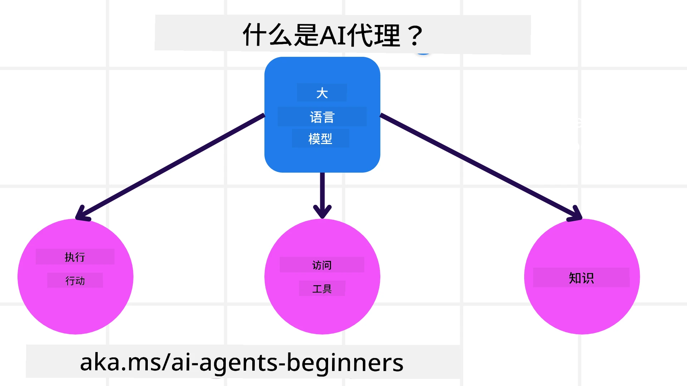

# 理解智能体：从回答问题到受控行动

## 学习目标与准备

本章面向会阅读基本 Python、尚未设计过智能体的学习者。你将用旅行推荐场景区分“模型生成了文字”和“系统执行了动作”，为一个任务选择合适的智能体类型，并写出可验证的能力边界。目标不是给聊天机器人换一个名称，而是能指出每项能力由哪个组件提供、如何检查它是否真的发生。

概念活动只需阅读本章和纸笔，不需要云账号。若要查看或运行源码，先完成[环境准备](00-setup.zh-CN.md)：目标环境是 Windows、PowerShell 7、Python 3.12+，源码固定为 `25b7985f3b2dc37a84f4a7387ccd3c9f0e5b1595`。平台仅展示手册，不会替你运行 notebook。

## 智能体是一个系统，不是一个模型

大型语言模型擅长理解自然语言、生成候选计划和组织答案。单独调用模型时，输出仍是文本或结构化消息；“我已经订好酒店”这句话本身不会产生订单。只有外围程序校验调用、执行已授权的工具、取得实际结果，系统才完成了动作。

可以从三个角度拆解旅行智能体：

| 系统部分 | 在真实旅行服务中是什么 | 在本模块 Python 示例中是什么 |
| --- | --- | --- |
| 环境 | 旅行平台、库存系统、用户当前请求 | notebook 进程、Foundry 项目和固定目的地列表 |
| 传感器 | 读取航班价格、酒店房态、用户偏好 | 用户输入，以及 `get_destinations` 返回的候选城市 |
| 执行器 | 创建订单、发送通知、取消预订 | 调用本地只读函数；没有真实订票或付款接口 |

图中三条连接表示模型可通过系统获得的能力，不意味着模型默认拥有任意外部访问权。图源为 Microsoft 课程的[简体中文组件图](https://github.com/deepenable/ai-agents-for-beginners/blob/25b7985f3b2dc37a84f4a7387ccd3c9f0e5b1595/translated_images/zh-CN/what-are-ai-agents.1ec8c4d548af601a.webp)，授权说明见[来源与许可](00-license.zh-CN.md)。

### 工具决定行动范围

工具可以是纯函数，也可以包装数据库、邮件服务或业务 API。开发者决定注册哪些工具，运行环境和凭据决定它们实际上能做什么。只注册“查目的地”的智能体，不应因为用户要求“买一张机票”就获得付款权。

本课的 `get_destinations()` 无参数，返回十个城市名称。它不访问天气服务、不查询当前价格，也不评价海滩质量。模型依据城市名称生成的气候与景点介绍，不能冒充工具核实过的实时事实。这条区分会贯穿后续的工具使用和 RAG 实验。

### 记忆、知识与学习不是同一件事

- **短期记忆**是一次会话中保留的消息、调用和结果，帮助理解“换一个地方”指什么。
- **长期记忆**可能是客户偏好库或过往交互记录，需要持久化、访问控制、过期和删除机制。
- **知识**可能来自静态文件、检索服务或模型训练数据，不一定属于某个用户。
- **学习**是利用反馈改进策略、规则、知识库或模型的过程。重复聊天并不自动训练模型；保存会话也不等于建立了长期记忆。

本模块 Python notebook 没有显式创建并复用 `AgentSession`，不能用它证明跨请求记忆。下一模块才会显式演示会话。

## 七类智能体及其选择依据

这些分类来自不同研究和工程视角，可以重叠，并不要求每类都使用 LLM。选择时应先问任务需要什么状态与决策能力，而不是追求最复杂的名称。

| 类型 | 决策方式 | 旅行示例 | 需要特别验证什么 |
| --- | --- | --- | --- |
| 简单反射型 | 当前条件触发固定规则 | 收到投诉邮件后转交客服 | 规则是否覆盖异常；通常普通程序更合适 |
| 基于模型的反射型 | 用内部环境状态补足当前观察 | 跟踪历史价格并发现突然涨价 | 状态是否及时更新；这里的“模型”不专指 LLM |
| 目标驱动型 | 为达成目标选择步骤 | 组合航班、酒店与租车完成行程 | 目标、停止条件、失败回退是否明确 |
| 效用驱动型 | 在多个可行方案间权衡得失 | 平衡价格、转机次数和舒适度 | 权重是否符合用户，而非系统擅自定义 |
| 学习型 | 用反馈调整后续行为 | 根据行后评价改进推荐 | 反馈保存在哪里、如何评估改进和回滚 |
| 分层型 | 上层拆解任务，下层处理子任务 | 把取消行程拆成三类取消操作 | 子任务失败时是否补偿，是否重复取消 |
| 多智能体系统 | 多个独立角色协作或竞争 | 酒店、航班、活动专家协作；供应商竞价 | 信息如何交接、冲突由谁解决、权限如何隔离 |

“分层”强调管理关系，“多智能体”强调多个参与者，二者可以同时出现。为了测试一个十城市推荐表，不必立即引入多智能体、长期存储和复杂规划。

## 什么时候值得使用智能体

### 适合的任务特征

**开放式问题**的路线难以预先枚举。例如用户既想温暖、又希望看建筑、还有预算限制，可能要先澄清偏好再筛选资料。智能体可根据返回结果调整下一步。

**多步骤过程**需要串联多个工具。例如确认日期、查库存、比较行程、请求确认。关键不是步骤多，而是后续步骤依赖前面发现的信息。

**持续反馈改进**要求系统接收环境或用户反馈。例如某类推荐反复被拒绝，可以在用户同意的范围内调整偏好；仍要通过评估证明调整有效。

### 不应默认使用智能体的情况

固定格式转换、严格计算、确定性规则分发通常应先用普通代码。单次文案生成可以直接调用模型。高风险、不可逆或要求严格时限的动作，即使使用智能体，也应由确定性验证器、授权策略和人工审批把关。

判断方法是比较新增收益与新增负担：动态选择工具能解决什么普通流程解决不了的问题？是否值得额外的模型调用、延迟、调试难度和错误风险？如果无法给出具体收益，先采用简单方案。

## 从业务目标到实现部件

### 开发：先写能力清单

不要从“选最大的模型”开始。先写用户目标、可读数据、可执行操作和禁止事项。例如：可以返回候选城市；可以说明资料不足；不能声称已订票；不得收集护照或银行卡。然后为每项能力选择实现方式和验证证据。

Microsoft Foundry Agent Service 提供模型与智能体服务能力，可连接不同供应商模型、授权数据源及标准化工具接口，例如 OpenAPI 3.0。具体供应商、地区、许可证和工具支持必须按实际项目确认；本实验只要求已有合适部署，不要求开通 Tripadvisor 等商业数据源。

### 模式：复用交互策略

设计模式是可复用的方法，例如“模型选工具—执行—返回结果”“先检索再回答”“提出方案后检查”。它们解决多轮交互问题，不只是写一条更长的提示词。模式可以由普通程序编排，也可以由模型在受限范围内决定下一步。

### 框架：减少重复工程

Microsoft Agent Framework（MAF）提供客户端、工具包装、智能体和会话等抽象，减少手写消息转换和调用循环。`FoundryChatClient` 是客户端连接器；Foundry Agent Service 是远端服务；二者并不是互斥产品。

框架能帮助连接工具、观察调用和组合多个角色，但不会替业务方决定权限、价格真实性、隐私策略或错误容忍度。示例运行成功也不是生产就绪证明。

## 活动：为旅行推荐写一份可执行的能力契约

1. 写下用户请求：“我想去温暖、有海滩的地方，请推荐可选目的地。”圈出不明确的条件，如季节、预算、出发地。
2. 画出“用户—模型—工具—结果—回答”的路径，并在工具旁注明“固定十城市列表，非实时服务”。
3. 从七类中选一个最简单的适配方案，说明是否真的需要目标规划、效用排序或学习。允许结论是“目前只需单智能体工具调用”。
4. 写三条验收规则：候选必须来自列表；没有真实预订；涉及天气或价格时说明数据限制。
5. 增加一个反例请求：“立即付款并订票。”写出系统应拒绝或说明无法执行的原因，以及将来增加付款工具时必须增加的审批条件。

### 预期结果与判定

完成后应得到一页能力契约，能为每条结论指出证据来源。若写了“查询实时天气”，却没有天气工具，这一项不合格；若写了“已确认支付”，却只有模型文本，这一项不合格。分类答案不要求唯一，但必须解释为什么更简单的确定性流程够用或不够用。

## 常见问题与纠偏

| 容易混淆的问题 | 排查方式 |
| --- | --- |
| 回答很像真人，是否说明有自主性？ | 查看是否根据目标选择了行动，别把自然语言风格当作能力证据 |
| 工具返回城市，模型能说当地天气吗？ | 可以生成一般介绍，但必须区分推断与被检索确认的事实 |
| 第二次问答提到上文，是否证明有长期记忆？ | 检查会话是否复用、数据是否持久化；单个样例不能证明长期记忆 |
| 多智能体一定比单智能体好吗？ | 比较任务分工收益与调用成本、交接错误、状态同步复杂度 |
| 有框架就不需要业务校验吗？ | 参数类型只能解决部分结构问题；付款、权限和业务规则仍须独立验证 |

## 费用、权限、删除风险与清理

本章纸面活动不产生云费用，不需要新增权限，不创建云资源。不要为了概念活动连接真实订单系统或上传真实客户资料。后续实践会调用远端模型并可能在项目中留下智能体或会话记录，须先获得预算和项目范围授权。

纸面练习无需资源清理；仅清除包含个人信息的草稿。若顺便运行过代码，按[首次智能体实践](01-practice.zh-CN.md)的清理步骤核对，不可将关闭 notebook 等同于删除云端对象，更不可删除共享资源组。

## 来源与演练状态

教学依据：[英文课程原文](https://github.com/deepenable/ai-agents-for-beginners/blob/25b7985f3b2dc37a84f4a7387ccd3c9f0e5b1595/01-intro-to-ai-agents/README.md)、[Python 源样例](https://github.com/deepenable/ai-agents-for-beginners/blob/25b7985f3b2dc37a84f4a7387ccd3c9f0e5b1595/01-intro-to-ai-agents/code_samples/01-python-agent-framework.ipynb)。内容以固定提交中的实际代码为准，译文只作语言参考。

**教学演练状态：待演练。** 已按源码解释能力边界，未把模型响应、课堂活动或云端运行写成已观察到的成功结果。
