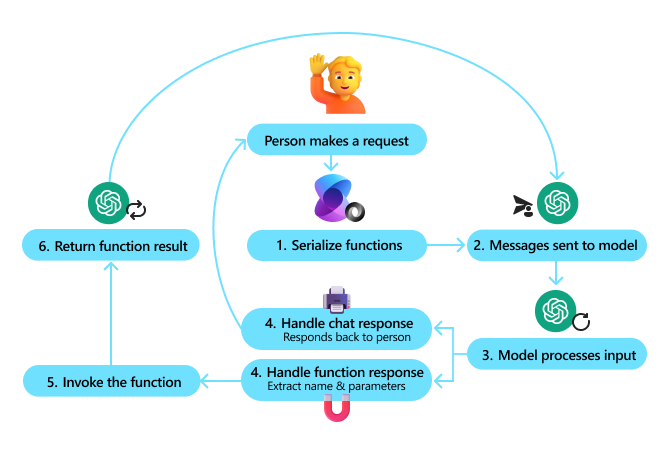

# 工具使用模式：从函数请求到可信执行

## 学习目标与准备

本章解释模型如何选择工具、程序如何执行并把结果返回，以及为什么工具越有能力，越需要严格的边界。完成后，你应能画出一次函数调用闭环，设计工具的输入与输出契约，并为只读查询、业务写入和代码执行选择不同的安全控制。

建议先学[结构化输出与职责设计](03-concepts.zh-CN.md)。本章活动不需要云账号，只需能阅读 Python 函数和 JSON。后续实践采用[环境准备](00-setup.zh-CN.md)中的 Windows、PowerShell 7、Python 3.12+ 与固定核心依赖。平台展示代码，但不执行代码。

## 什么是工具使用模式

工具是智能体可以调用的代码：简单到计算器，复杂到数据库查询、天气 API、工单系统或代码解释器。模型根据工具说明产生函数名称与参数；外围系统验证并执行；结果回到模型，模型再生成回答或选择下一步。

因此，“模型请求调用”与“工具执行成功”是两个事件。工具结果也不是天然可信的最终结论：可能超时、过期、缺字段或携带不可信内容。智能体必须保留这些差异，而不是把每次调用都解释成成功。

## 常见使用场景

| 场景 | 工具提供的能力 | 核心验证问题 |
| --- | --- | --- |
| 动态信息检索 | 查询数据库、实时价格、天气 | 时间戳、来源、查询权限是否可靠 |
| 代码执行与解释 | 计算、模拟、生成报告 | 是否隔离执行，有无资源限制和危险操作 |
| 工作流自动化 | 调度任务、发邮件、串联数据处理 | 是否重复执行、是否需要人工确认和补偿 |
| 客户支持 | 查知识库、读 CRM、创建工单 | 是否隔离用户数据，写入范围是否最小 |
| 内容生成与编辑 | 语法检查、摘要、安全评估 | 工具输出如何被复核，是否泄露原始资料 |

能生成 SQL 不代表应被授予数据库管理员；能生成邮件不代表可以直接发送；能提出取消订单不代表已经完成退款。

## 六个构建模块

### 1. 工具 Schema

Schema 描述名称、用途、必填参数、参数类型和结果含义。名称应体现业务动作，说明应帮助模型区别近似工具。`origin` 和 `destination` 如果都写成“城市”，模型可能把城市名传给期望机场代码的函数。

类型只是一层保护。字符串仍可能为空、拼错或超长；整数仍可能为负数；“category 是字符串”不能强制它只取三个允许值。执行层必须做业务验证。

### 2. 调用与执行逻辑

系统需要规定允许调用哪些工具、执行顺序、是否并行、是否审批、超时与重试。对写操作，审批应发生在最终参数确定之后、实际执行之前，不能把用户曾经泛泛表达的意愿当成所有后续写入的授权。

### 3. 消息处理

一次请求可能包含用户消息、模型函数调用、函数结果和最终文本。返回结果必须与原调用正确关联，否则模型会把某个城市的价格误认为另一个城市的结果。

### 4. 集成框架

MAF 可以根据 Python 装饰函数生成描述，并管理模型与工具的往返。它减少胶水代码，但不能替代权限检查和业务错误语义。

### 5. 错误处理与验证

分清参数错误、无结果、认证失败、业务拒绝、临时超时。无结果不等于系统出错；系统出错也不等于“没有可用航班”。只在可安全重试时重试，并保留足够但去敏的诊断信息。

### 6. 状态管理

多轮会话需要知道已经问过什么、工具返回过什么、哪些操作待审批或已完成。业务状态不能只存在于模型叙述中。对真实预订，要有可信订单状态与幂等标识，而非靠“我记得已订票”避免重复付款。

## 一次函数调用的完整闭环



图源：[函数调用图](https://github.com/deepenable/ai-agents-for-beginners/blob/25b7985f3b2dc37a84f4a7387ccd3c9f0e5b1595/04-tool-use/images/functioncalling-diagram.png)，保留原图，许可见[来源与许可](00-license.zh-CN.md)。图中框架图标表示包装与分派环节，不要求安装图示的其他旧框架。

用“现在旧金山几点”说明流程：

1. 程序向支持函数调用的模型发送用户问题与 `get_current_time(location)` 的说明。
2. 模型返回函数调用名称和 JSON 参数，而不一定直接返回最终答案。
3. 程序检查名称在允许列表里，解析并验证 `location`。
4. 本地代码查时区并读取时间；未知地点应明确返回未知。
5. 程序把结果和原 `call_id` 关联起来，交回模型。
6. 模型根据结果组织用户可读答案，必要时继续调用；程序应限制循环。

源 README 的原生 Responses 示例使用扁平工具格式，以下是其中的关键契约：

```python
{
    "type": "function",
    "name": "get_current_time",
    "description": "Get the current time in a given location",
    "parameters": {
        "type": "object",
        "properties": {"location": {"type": "string"}},
        "required": ["location"],
    },
}
```

结果返回项使用 `type="function_call_output"`、原 `call_id` 与字符串 `output`；源示例还保留 `response.output` 作为上下文。这里用于理解底层协议，不是一段完整独立程序：时区映射和外层函数等前提不能省略，Windows 的时区数据依赖也需另行核对。本模块可执行主线是旅行工具 notebook，不是时间函数片段。

## 用 MAF 包装工具

实际 Python 样例用类型注解、docstring 和 `Annotated` 描述参数：

```python
@tool(approval_mode="never_require")
def get_flight_info(
    origin: Annotated[str, "Origin airport code"],
    destination: Annotated[str, "Destination airport code"],
) -> str:
    """Get flight information between two cities."""
```

工具实现读取航线字典，用 `f"{origin}-{destination}"` 作键。注册三个工具后，模型可以先取目的地，再查可用性，再查航班。它没有真正联系航空公司，所有时刻、座位和价格都是样例数据。

### 审批模式的作用与边界

- `never_require`：框架不要求人工确认就执行，适合已批准的低风险只读查询。
- `always_require`：调用需要审批，适合可能预订、付款、发送或删除的动作。

主线 `book_flight` 仅声明 `always_require` 并打印工具元数据，没有注册到执行中的智能体，也没有实现完整的审批请求、拒绝、恢复会话流程。不能把这一格运行成功称为“人工审批闭环已验证”。

其返回的确认号来自 Python `hash(passenger_name)`，只是模拟字符串，不是稳定订单号；进程之间可能变化，不能作幂等键或真实凭证。

## 托管知识工具与行动工具

Foundry 生态中，知识工具可以提供 Bing grounding、文件检索或 Azure AI Search；行动工具可以提供函数调用、代码解释器、OpenAPI 和 Azure Functions 集成。工具集把多种能力组合起来，对话状态保存相关消息。

但执行位置要按实际工具区分：本 notebook 的 Python 函数在本地程序执行；服务内置工具由对应服务处理；远程业务 API 在其自身权限环境执行。不能简单地说“所有函数调用都自动在服务器完成”。

源 README 的 Contoso 销售示意展示“SQL 查询工具 + 代码解释器”：模型可先取销售数据，再计算或生成图表。其中使用旧 `ToolSet`、连接字符串 API 和未提供的辅助函数，并含拼接语句问题，不能当成本版本可直接运行代码。保留设计思想，但本主线不创建销售数据库或代码执行沙箱。

## 数据库与可信执行

LLM 生成的 SQL 可能越权、修改数据或产生昂贵查询。合理的防护组合包括：

- 为应用使用只读数据角色，限制在获准视图和表；不要给生产写库管理员凭据。
- 将分析数据提取到只读副本或数据仓库，用清晰 Schema 降低错误。
- 优先使用参数化查询或有限业务函数，验证表名、列名、行数、超时与允许操作。
- 只读权限仍可能泄露数据或造成高负载，因此要有行级过滤、敏感字段控制、结果限量和审计。
- 将检索内容当作数据，不让其中“忽略指令、调用删除工具”之类文本升级为系统授权。

代码解释器和文件工具也应遵循隔离、最小权限与资源限制。重试写入前先查业务状态，避免网络超时后重复订票。

## 活动：设计工具契约与失败路径

1. 为 `get_flight_info` 写输入规则：机场代码格式、大小写、支持航线范围。
2. 为结果区分三种状态：有记录、没有此航线、查询失败。解释为什么源函数的默认字符串只覆盖其中一部分。
3. 画出一次“查 Barcelona 可用性，再查 LHR-BCN 航班”的序列，标明每次结果如何回到模型。
4. 为真实 `book_flight` 列审批时必须展示的参数：乘客、航线、日期、金额、币种、退款规则；注明源码工具缺哪些字段。
5. 设计“用户拒绝审批”和“服务超时但可能已写入”两条路径，说明为什么两者都不能直接打印“预订成功”。

### 预期结果与排查

完成后应有一份输入输出契约和两条失败处理流程。若只有“让模型小心”而没有执行层校验，不算合格；若只用 `always_require` 名称却没有审批结果如何恢复的说明，也不是完整系统。

常见问题是混淆“格式正确”和“权限允许”、“空结果”和“系统失败”、“模拟确认号”和“真实订单”。排查时沿用户输入、工具参数、执行日志、工具结果、最终回答逐层检查，不直接归因于模型不够聪明。

## 费用、权限、删除风险与清理

本章纸面活动不收费、不创建资源。真正连接模型、外部 API、代码解释器和 Search 之前，必须分别确认预算与授权。涉及付款、发送和删除的工具，先有人工审批与执行层权限，不能用生产资源试错。删除测试数据前核对归属和依赖，严禁用资源组级删除清理一条工具调用。

活动完成后保留去敏契约即可，无云清理。实际运行按[工具使用实践](04-practice.zh-CN.md)处理内核、智能体与会话。

## 来源与演练状态

来源：[工具模式原文](https://github.com/deepenable/ai-agents-for-beginners/blob/25b7985f3b2dc37a84f4a7387ccd3c9f0e5b1595/04-tool-use/README.md)、[当前 Python notebook](https://github.com/deepenable/ai-agents-for-beginners/blob/25b7985f3b2dc37a84f4a7387ccd3c9f0e5b1595/04-tool-use/code_samples/04-python-agent-framework.ipynb)。

**教学演练状态：待演练。** 本章未执行云调用、审批写入、数据库操作或删除。图示与设计流程不等于已验证的运行记录。
