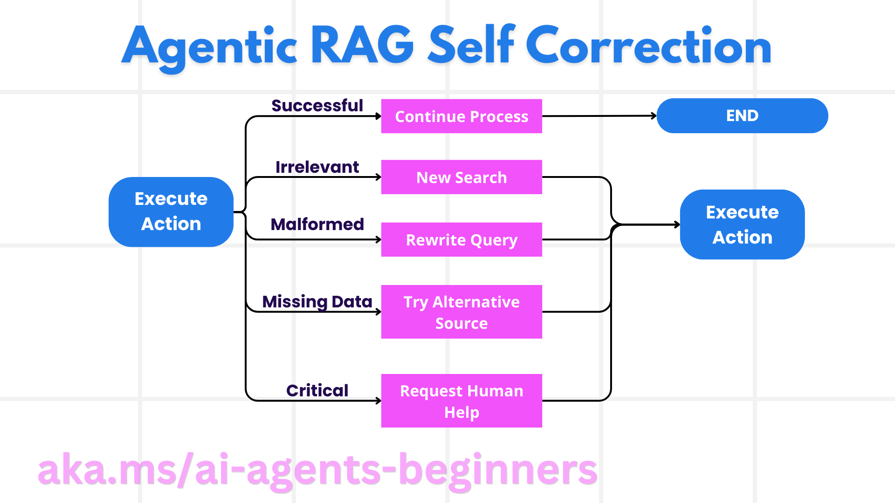

# 智能体式 RAG：让检索、核验与回答形成闭环

## 学习目标与准备

本章解释 Agentic RAG 如何让模型在受限工具范围内选择检索、评估结果和继续查询。完成后，你应能区分静态 RAG 与动态检索，设计 maker-checker 核验过程，识别无结果、错查询和证据不足，并为循环设定停止及人工接管条件。

建议先掌握[工具使用模式](04-concepts.zh-CN.md)。概念活动使用四条公开演示旅行资料，不需要云账号。运行实践时再按[环境准备](00-setup.zh-CN.md)使用 Windows、PowerShell 7、Python 3.12+ 与固定提交。**本模块 Python 主线是内存关键词检索，不要求创建 Azure AI Search、Storage 或向量索引。** 平台不会运行本章代码。

## 从静态 RAG 到动态检索

检索增强生成（Retrieval-Augmented Generation，RAG）把外部资料提供给模型，减少答案只依赖训练知识的情况。常见静态流程是“接收问题—检索若干片段—生成答案”，路径事先确定，模型不一定能发现资料不足后主动再查。

Agentic RAG 把检索封装成工具，允许模型根据任务和结果选择：

- 是否需要补充资料；
- 查询哪个来源、使用哪些词；
- 是否重写失败查询；
- 是否换检索方式；
- 是否证据足够可以回答，或应承认不足并停止。

这种自主性是**任务内决策权**，不是通用智能，也不表示模型可以创造未注册工具、绕过权限或自行扩大任务。动态选择仍要受开发者设定的领域、资源、预算和政策限制。

本例的 `TravelRAGAgent` 指令明确要求目的地问题先检索，这比一般 Agentic RAG 的“可选择是否检索”更严格；模型仍可决定查询词及后续步骤。应把概念能力和本样例配置分开说明。

## Maker-checker：提出与核验的迭代

Maker 负责根据初次资料形成候选结论；Checker 负责发现缺口、再检索并检查约束。二者可以是同一智能体的不同阶段，不一定需要两个独立模型。

例如预算每天 175 美元、四月旅行：

1. 初查候选城市及日均费用；
2. 对每个候选再按城市名称查询完整资料；
3. 分别检查预算范围与最佳季节；
4. 对不确定项继续确认，或告诉用户没有完全符合证据的方案；
5. 给出带限制的推荐，而不是把缺信息补成确定事实。

当前 notebook 的 `TravelRAGCheckerAgent` 通过指令要求这种过程，但没有独立评分器、循环计数器或形式化验证器。因此重复检索是待观察行为，不保证每次一定发生，也不保证一发生就纠正了错误。

## 由系统决定下一步，而不是预写每一步

以产品发布策略为例，系统可能先查市场趋势，再查竞争者资料，关联内部销量，综合策略，再检查遗漏。不同来源可包括 Bing grounding、Azure AI Search、Azure SQL、自定义 API、Fabric OneLake 等。

重要的是从“发现缺口”推导“选择下一项工具”，而非固定执行全部来源。调用越多不代表越好：如果核心证据已充分，继续查询会增加费用、暴露更多数据或引入冲突。

源课程举这些企业服务说明扩展方向；本实验并未连接它们。要加入任意来源，需单独确认许可、数据访问、网络、费用及工具实现。不能把“可用工具列表”当成已经开通的服务清单。

## 循环、工具集成、记忆与状态

一个可理解的循环是：

1. 接收用户目标与约束；
2. 识别缺失证据，构造查询；
3. 执行工具，取得原始结果；
4. 检查相关性、完整性、时间与冲突；
5. 选择继续检索、请求澄清、人工接管或回答；
6. 记录尝试及结果，避免重复。

状态中应保存查询词、已查来源、候选项、错误、待核实事项和已花预算。仅让模型“记得以前查过”不够，生产系统需要可检查的记录和重复查询限制。跨步骤状态也不自动等于跨会话长期记忆。

本模块主线没有显式创建 `AgentSession` 供多个 `run` 复用。每次运行内部可进行工具往返，但不能据此声称两次独立调用永久共享用户历史。

## 失败模式与自我纠正



图源：[自我纠正示意](https://github.com/deepenable/ai-agents-for-beginners/blob/25b7985f3b2dc37a84f4a7387ccd3c9f0e5b1595/05-agentic-rag/images/self-correction.png)，许可见[来源与许可](00-license.zh-CN.md)。图中 Successful 表示达到检查标准后继续；Irrelevant 应重新搜索，Malformed 应改写查询，Missing Data 可换已授权来源，Critical 应请求人工帮助。这是设计路径，不是本 notebook 已实现的全部分支。

### 无关资料：改写，不要堆砌

关键词太宽、常见词太多或数据源不匹配时，可能返回大量无关文本。先检查查询与命中原因，缩小词义或改用精确标识；不要把全部结果拼进提示，以为更多上下文一定更准确。

### 查询格式错误：利用诊断信息

自然语言转 SQL 可能用错表名、字段名或语法。诊断工具可返回允许的 Schema 或有限错误分类，帮助重新构造查询。绝不能为了让错误 SQL 成功而扩大数据库权限，也不能允许无界重试。

### 缺失数据：承认限制

没有结果可能是查询方式不适配，也可能数据确实不存在。先尝试有理由的替代表达；仍无证据就说明缺失。不能用模型训练知识填补后仍标为“来自知识库”。

### 高风险或重复失败：交给人

合规、法律、财务或安全相关答案，即使经过多轮检索也仍需专业复核。人工反馈可以更新当前任务的约束；若要将反馈持久化，必须获得授权并制定质量控制。

## 当前内存检索到底做了什么

主线知识库只有 Barcelona、Tokyo、Paris、Cape Town 四条英文字符串，包含季节、亮点和日均费用。核心匹配代码：

```python
if query.lower() in destination.lower() or any(
    word in info.lower() for word in query.lower().split()
):
    results.append(f"**{destination}**: {info}")
```

它没有分词器、向量、嵌入模型、相关性排序、文档引用 ID 或数据库。查询词的任意子串命中描述就加入结果，所以：

- `architecture` 能匹配 Barcelona；
- `Tokyo` 可按目的地名命中；
- `April` 不等于文本中的 `Apr`，可能完全无结果；
- `Apr` 能命中 Tokyo 与 Paris 的描述，却不懂 Barcelona 的 `Mar-May` 区间也包含四月；
- 空字符串是所有字符串的子串，可能返回全部资料；
- 中文“巴黎”不会自动对应英文 `Paris`。

这并不否定 RAG，而是提醒：智能体查询改写能力必须建立在理解实际检索器行为的基础上。四条数据适合观察模式，不代表实现了企业级语义搜索。

## 应用价值与自主边界

**正确性优先任务**可以通过多源交叉核对减少遗漏，但多源也可能共同复制同一错误。应评价证据质量，而非只数引用数量。

**复杂数据库交互**可以根据诊断重新查询，但 SQL 仍须有只读权限、参数与资源限制。

**长流程任务**可以在新证据出现时调整路线，但需要持久状态、取消、恢复和预算上限。本 notebook 只演示短流程，不保证长时间自主运行安全。

三条边界始终成立：任务只在获准领域内；能力受实际工具与基础设施限制；伦理、合规和业务规则必须由可执行控制支持，不能只寄希望于模型自觉。

## 治理、透明度与信任

### 留下可审计证据，而非要求私有思维

有用的记录包括查询、工具名称、来源、返回片段、简短决策理由和未核实事项。无需要求模型公开私有逐步思维。Tracing、GenAIOps、内容安全及评估工具可帮助观察，但它们需要显式接入；当前样例并未自动配置完整追踪平台。

### 控制检索偏差

只检索容易获取或商业偏向的数据，会让结果失衡。应审查来源代表性、语言覆盖、日期、地域偏差及遗漏情况；不能认为“有检索”就消除了偏见。

### 让人工保有判断权

用户应知道哪些结论来自资料、哪些是推断、哪些缺乏证据。高风险结论需人工确认；检索结果内的指令是外部数据，不能覆盖系统的权限与安全政策。

## 活动：审查四月预算推荐

1. 从知识库抄出四个城市的最佳季节与日均费用，只记录这些公开演示字段。
2. 按“每天最多 175 美元、四月处于所列最佳季节”检查每个城市。
3. 比较 `April`、`Apr`、`Barcelona` 三种查询策略，说明一次关键词检索可能遗漏什么。
4. 写 maker 草案，再写 checker 需要核对的具体证据，区分“预算范围可能包含 175”与“保证不超过 175”。
5. 设定停止规则：最多进行有限次有理由的查询改写；仍无完备证据则澄清预算或季节可否放宽，不能无限循环。

### 预期结果

应发现：Tokyo 和 Paris 的日均下限高于 175；Cape Town 日均适配但所列最佳季节不含四月；Barcelona 季节适配，但 150–200 的范围不能保证每天不超过 175。因此没有能由现有资料保证完全满足严格条件的方案。可以提出有条件折中，但必须解释限制。

## 故障排查、风险与清理

检索无结果时先查语种、月份缩写与匹配算法；结果太多时检查常见词和空查询；有结果但回答错误时检查约束判断与转述，而不是只换搜索服务。重复查询时查看是否重复同样参数、是否有停止机制。

本章活动不收费、不创建资源。后续模型往返会计费；外部 Search、存储、索引和向量处理另有资源成本。新增来源前先确认数据许可与最小权限。删除索引、文件或服务前核对独立实验归属，不可删除共享资源组。纸面活动只保留去敏检查表，无云清理；实际运行见[Agentic RAG 实践](05-practice.zh-CN.md)。

## 来源与演练状态

来源：[Agentic RAG 原文](https://github.com/deepenable/ai-agents-for-beginners/blob/25b7985f3b2dc37a84f4a7387ccd3c9f0e5b1595/05-agentic-rag/README.md)、[Python notebook](https://github.com/deepenable/ai-agents-for-beginners/blob/25b7985f3b2dc37a84f4a7387ccd3c9f0e5b1595/05-agentic-rag/code_samples/05-python-agent-framework.ipynb)。源课程提到的 Self-Refine、Reflexion、CRITIC 与 Agentic RAG 综述是理解迭代反馈、工具批评与检索规划的进一步阅读，不是本样例已实现这些论文算法的证明。

**教学演练状态：待演练。** 本章推导来自静态资料与代码，不是模型实测答案或企业部署的运行报告。
