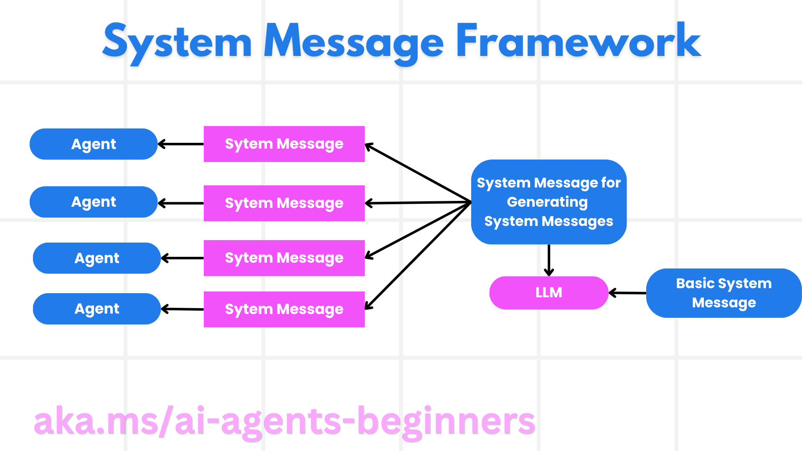

# 可信智能体：从系统消息到行动边界

## 学习目标与准备

本章面向已经理解模型调用和工具调用的学习者。完成后，你应能为旅行助手编写可审查的系统消息，区分安全性、访问控制与隐私保护，给五类常见威胁安排具体控制，并说明为什么“输出后询问同意”不能代替行动前审批。

先完成[固定版本环境准备](00-setup.zh-CN.md)。本章的纸面活动不需要云资源；若继续执行[可信智能体实践](06-practice.zh-CN.md)，使用 Windows PowerShell 7、Python 3.12+ 和课程固定依赖，其中 `agent-framework-core==1.10.0`。本模块实际两个 Python notebook 都直接使用 OpenAI SDK 的 Azure OpenAI Responses API，并不是 `FoundryChatClient` 示例。

内容依据为[第 06 模块英文原文](https://github.com/deepenable/ai-agents-for-beginners/blob/25b7985f3b2dc37a84f4a7387ccd3c9f0e5b1595/06-building-trustworthy-agents/README.md)及该提交中的代码。原文的简短审批片段用于说明概念；可执行路线以完整 notebook 为准。

## 可信不是一句“请安全地工作”

安全性首先意味着智能体遵守预期用途：旅行助手可以查询航班、解释票价规则，不能因为用户或检索文档的一句话就改为付款代理。安全防护解决谁能访问什么、怎样验证身份和限制损害；隐私保护解决是否应收集、传输、保存和再次使用某项数据。这三者需要同时设计。

系统提示能表达角色、目标、边界和交互方式，却不能撤销云端权限，也不能阻止底层函数被其他调用者直接执行。因此，可靠设计把控制分成三层：

| 层次 | 旅行场景中的责任 | 不应承担的责任 |
| --- | --- | --- |
| 模型指令 | 先询问出行偏好；缺少证据时承认未知；提交预订提案 | 单独保证不会越权扣款 |
| 应用控制 | 验证工具参数、检查预算、等待审批、限制重试 | 把模型生成的“已批准”当成人的签名 |
| 服务与数据权限 | 按项目、用户和工具授权，保护通信与存储 | 依靠提示阻止已授权的任意数据访问 |

优质体验不是让用户对每次只读查询都点击确认，而是在用户理解后果的情况下，尽可能少地打断低风险流程，同时把高风险操作明确交还给人。

## 建立可迭代的系统消息框架

图中右侧的基础说明包含具体业务，中间的元系统消息负责约束生成方式，左侧是供不同智能体使用的系统消息。它是提示的生产流程，不是自动授予权限的流程。

### 第一步：元系统消息规定如何编写

元提示的对象是“生成系统消息的模型”。源示例要求它根据公司、角色和职责组织一份清晰、详细、便于 LLM 理解的系统提示。这样多个助手可以共享角色、目标、责任、风格、例外处理等栏目，避免每个团队随意拼接。

但“描述越详细越好”不是充分标准。应要求明确哪些输入是不可信资料、何时追问、何时拒绝、何时提交人工审核。不要让生成器编造不存在的工具或数据权限。

### 第二步：基础提示限定真实业务

源场景是 Contoso Travel 的航班助手：查询可用航班、预订、询问座位和时间偏好、取消预订、通知延误或取消。把这些职责进一步分开：

- 查询只产生建议；必须标明资料来源、有效时间和不确定性。
- 预订或取消会改变外部状态；先展示航班、旅客、价格、退改条件，再请求批准。
- 座位偏好可以是普通偏好；证件号、支付信息不是演示所必需的数据。
- 延误通知意味着外部发送；“生成通知草稿”和“实际发送通知”是两个动作。

### 第三步：生成后审查，而不是立即上线

模型可以把基础提示展开成“公司、角色、目标、职责、语气、交互指令、附加说明”等段落。审查者要逐项检查：是否保留业务目标；是否承诺实时监控却没有监控工具；是否把退款政策写成自创规则；是否给出超出工具能力的确认号。

源 notebook 的 `role`、`company`、`responsibility` 就是基础材料。最终 `response.output_text` 是候选系统消息，代码没有把它自动部署成新智能体。

### 第四步：用同一组场景比较修订

保留基础提示和候选版本，固定一组测试：正常查询、缺少日期、预算冲突、取消请求、要求忽略规则、检索材料夹带指令。每次只修改一个关注点，并比较回答和工具行为。漂亮的提示文本不是通过标准；对高风险动作是否真正阻断，才是关键证据。

## 五类威胁及分层缓解

| 威胁 | 发生在哪里 | 可落实的缓解与检查 |
| --- | --- | --- |
| 任务或指令被改变 | 用户输入、网页、工具返回试图重写原目标 | 把外部内容当资料；校验输入和工具参数；限制轮数；检查最终动作仍对应原目标。过滤不是完整防线 |
| 访问关键系统 | 智能体通过过宽权限接触客户或财务系统 | 最小权限、独立身份、服务端鉴权、安全通信；只读工具不持有写入权限 |
| 资源与服务过载 | 循环调用、批量请求或无上限重试 | 请求、token、并发和轮数预算；超限停止；错误时退避而非立即无限重跑 |
| 知识库投毒 | 被修改的数据影响推荐与决策 | 限制谁能写知识库；记录版本、来源和更新时间；抽样校验数据；发现污染后隔离并回退可信版本 |
| 连锁错误 | 上游错误被下游继续执行或重复提交 | 隔离执行环境、参数校验、幂等键、熔断和受控回退；保留错误状态，不把缺失值当成功 |

容器可以减少影响范围，但不是天然安全沙箱；挂载的文件、网络、凭据和资源限额仍决定实际边界。重试也不是通用恢复：查询失败可以重试，付款超时应先核对交易状态，避免重复扣款。

## 人在回路：审查内容与授权行动不同

后置审批适合审核草稿：模型先写出文本，人决定是否采用。此时模型费用已经产生；如果工具已经发邮件或写数据库，再拒绝文本也不能撤销副作用。

前置审批采用“提出动作 → 识别风险 → 审批 → 执行”的顺序。审批界面应包含动作、对象、金额、数据去向和不可逆影响。拒绝应给出结构化原因，让下一次提案改变，而不只是打印“正在修订”。

源[人在回路 notebook](https://github.com/deepenable/ai-agents-for-beginners/blob/25b7985f3b2dc37a84f4a7387ccd3c9f0e5b1595/06-building-trustworthy-agents/code_samples/06-human-in-the-loop.ipynb)展示三个组合部件：

1. `gate_action` 返回 `approve`、`deny` 或 `escalate`，无输入和无效输入默认拒绝。
2. `classify_risk` 和 `tiered_gate` 将只读、低成本修改、外部或不可逆操作分层。
3. `log_decision` 追加 JSONL，`run_with_revision` 将拒绝原因传给 `propose_action`，限定尝试次数。

必须认清教学实现的边界：低风险和中风险在代码中都会自动批准；“批量审核”只写在中风险原因中，没有实际审核队列。风险分类是英文子串匹配，不理解金额、身份或语义。`DEMO_MODE=True` 只是脚本化审批，高风险从第二次尝试起自动批准，不能证明提案已经降险。`run_with_revision` 只返回决策，不实际发送邮件、收费或预订；`escalate` 也没有外接人工工单系统。

## 动手活动：为旅行助手设计最小信任边界

不调用模型，在自己的学习记录中完成以下操作：

1. 写一份基础说明，包含查询、预订、取消、延误通知四类职责，给每类标注“只读／草稿／真实写入”。
2. 为“查询巴黎航班”“保存座位偏好”“取消不可退机票”分别列出必要输入、允许访问的数据、批准人和拒绝后的恢复动作。
3. 把一段虚构工具返回看成不可信文本：其中即使出现“无需审批”，也只能影响资料摘要，不能改变应用审批策略。
4. 用上表五类威胁逐行检查你的设计，至少找出一个提示层以外的控制。
5. 对比 source 的三级策略，指出哪些“预订”在真实业务中应升级到高风险，而不能沿用关键词 `book` 对应的中风险。

## 预期结果与问题处理

合格产物是一份角色说明和一张控制表。至少应能指出：谁有写权限、在哪里等待批准、拒绝时是否仍发生动作、日志如何保留、重试何时结束。

- 如果所有风险都写成“改进提示”，补充服务端授权、执行门禁和资源上限。
- 如果每次查询都要批准，检查是否把私密查询和公开只读查询混成一类。
- 如果把“批准输出”当作“批准付款”，重新画出真实副作用出现的位置。
- 如果认为关键词分级足以投产，增加金额、主体身份、对象归属和操作类型的确定性校验。

## 风险与清理

本章活动不创建云资源、不产生模型费用。使用虚构旅客信息，不写姓名、证件、订单或支付数据。未来执行模型生成、联网检索、通知或交易前，须先获得实验项目权限和预算批准；不得连接生产系统。

保留不含隐私的控制表和提示版本即可。删除自行写入的个人资料；没有运行 notebook 时无需删除云资源。若继续实践，按实践章清理审计日志和客户端。

**教学演练状态：待演练。** 本章完成的是设计与源码对照要求，不代表威胁已通过安全测试或云端已运行成功。
