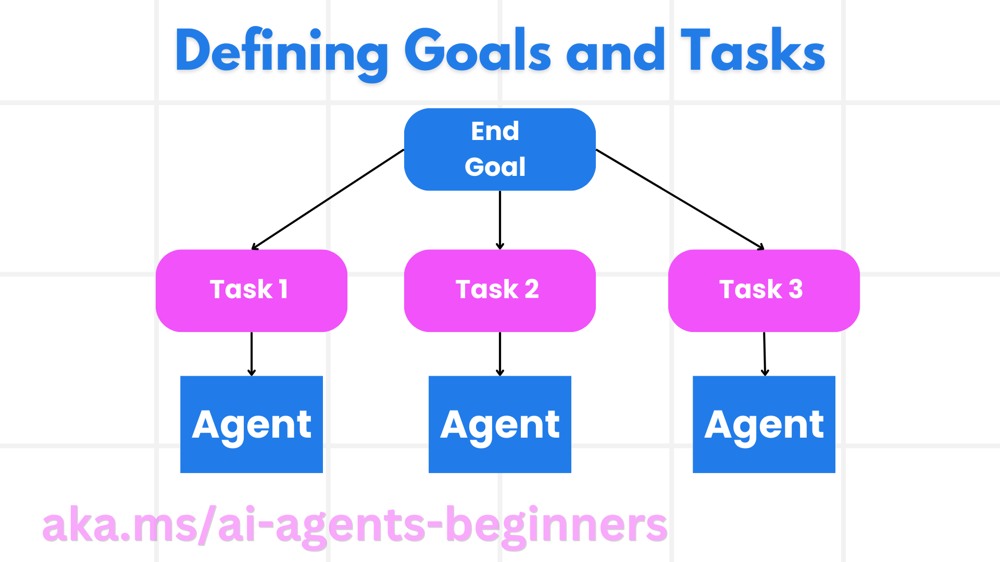

# 规划设计：把目标变成可验证的任务图

## 学习目标与准备

本章帮助你把“安排一次旅行”转换为清晰目标、结构化子任务和执行约束。完成后，你应能解释规划与执行的分工，识别任务依赖和工具权限，检查模型生成的计划，并在用户反馈或工具失败后决定哪些部分需要重排。

先完成[环境准备](00-setup.zh-CN.md)，了解 Python 函数、JSON 和工具调用。概念活动可以完全离线完成；配套实践使用 Windows PowerShell 7、Python 3.12+、`agent-framework-core==1.10.0`。正文依据[第 07 模块原文](https://github.com/deepenable/ai-agents-for-beginners/blob/25b7985f3b2dc37a84f4a7387ccd3c9f0e5b1595/07-planning-design/README.md)，API 与模型字段以固定提交的 Python notebook 为准，而不是旧 README 片段。

## 从模糊请求到明确目标

“生成三天行程”只说明产物，没有说明出发地、人数、预算、交通限制或成功标准。规划器首先应澄清约束，再定义可检验的目标，例如：为一对喜爱艺术与美食的旅客安排七天巴黎旅行，预计总预算不超过 5000 美元，列出航班、住宿和活动任务，尚未批准任何真实预订。

目标至少包含：

- **范围**：做推荐、做报价还是实际购买，三者不能混同。
- **硬约束**：人数、日期、预算上限、无障碍需求和禁止事项。
- **软偏好**：喜欢艺术、历史或本地餐厅，可在冲突时协商。
- **交付与完成条件**：结构化计划、已核验的工具结果、待用户批准的事项。

如果日期未提供，规划器应追问或明确假设，不能把自己生成的日期当作用户授权。预算只是模型估计时，也不能被表述为真实报价。

## 任务分解与依赖



源课程把旅行拆成航班、酒店、租车、个性化推荐等任务；还可逐步增加餐饮和本地活动专家。分解的价值是边界清楚、便于测试、失败可定位、可以分项预算和优化，不是简单让模型输出更多条目。

### 子任务应小到可交付

“安排一切”不是好子任务；“确定入境与离境日期后，查找两人入住且符合预算的酒店”更易执行。每个任务要有责任方、输入、输出、优先级、依赖和失败处理。工具提供的是具体能力，例如查航班或保留酒店；角色名称不会自动产生这些能力。

优先级不等于依赖。“酒店很重要”不能让它在航班日期未知时盲目下单。有些查询可以并行，真实预订则可能必须等预算与日期确认。若出现循环依赖，应先澄清或拆分查询与确认阶段，而不是随便挑一个开始。

### 计划图要由程序验证

当前 Python 的 `TravelSubTask` 使用 `task_id`、`description`、`assigned_agent`、`priority`、`dependencies`，`TravelPlan` 使用目的地、天数、任务列表、总估算预算和说明。

Pydantic 能检查字段和类型，但源码中 `assigned_agent` 与 `priority` 是普通字符串，不是枚举；整数预算也没有正数限制。合法的 JSON 不保证：

- 任务编号唯一；
- 依赖引用真实存在且没有环；
- 被分配的智能体真的存在；
- 工具具备业务权限；
- 预算、日期与人数符合用户请求。

因此，进入执行器前需要业务验证。对于未知执行者，安全做法是暂停并重新规划，而不是让模型临时创造一个有权限的代理。

## 结构化输出如何连接规划与执行

自然语言计划适合人阅读，却难以稳定路由。结构化输出把“做什么”转成机器可以检查的对象。源码实际用法是：

```python
result = await planning_agent.run(
    "Plan a 7-day trip to Paris for a couple interested in art, cuisine, and history. Budget around $5000.",
    options={"response_format": TravelPlan}
)
plan = result.value
```

`result.value` 是后续读取的计划对象，而不是把 `response.output_text` 随意交给 `json.loads`。源 README 曾展示 `AgentEnum` 和另一套旅行模型；本次实践不混用它们，也不复制其中未定义 `client` 的片段。

结构化输出既能建立接口契约，也能暴露问题：缺字段时失败比悄悄执行错误任务更安全。解析失败应保留去敏错误并停止执行；有限重试可以明确告诉规划器哪个字段不合格，但不能无限请求同一结果。

## 协调、路由与执行边界

更完整的系统可以先由语义路由器识别用户意图，再交给规划器。规划器维护可用智能体及工具注册表：单一子任务可直接路由给专家，多任务可交给群聊管理器或确定性工作流协调，最后汇总结果。

当前 notebook 采用更小的实现：`TravelPlanner` 生成计划，`Concierge` 读取计划文本并调用三个工具——`book_flight`、`reserve_hotel`、`book_activity`。它没有为每个 `assigned_agent` 创建独立专家实例，也没有编写拓扑排序执行器。所谓“尊重依赖”主要来自提示，实际顺序仍需观察和检查。

三个工具返回带确认号的字符串，没有航空公司、酒店或支付服务。确认号由 Python `hash` 计算，跨进程可能变化。字符串里有 “booked” 不等于真实预订成功。

## 迭代规划与事件驱动

计划应能随环境变化更新，但不应把已完成的不可逆动作重新执行。可把变化理解为事件：

| 事件 | 应保留的信息 | 可能重排的部分 |
| --- | --- | --- |
| 用户改为更早出发 | 人数、偏好、已确认预算 | 航班查询、酒店入住日期、接送时间 |
| 航班返回意外格式 | 原请求、原始错误、已完成状态 | 解析或替代航班工具，不先改酒店政策 |
| 预算不足 | 已知实际价格与支出 | 酒店档次、活动组合；重新征求取舍 |
| 用户拒绝某项预订 | 拒绝理由、获批和未获批任务 | 被拒绝任务及依赖它的下游任务 |

一次重排应记录“原计划、触发事件、已完成任务、失效任务、新计划版本”。这样反思、总结器、轮询群聊等模式才能基于真实状态工作。只把 `TravelPlan` 类名插进上下文，不等于传入上次的计划实例。

源课程提到 Magentic-One 的编排思路：协调者创建任务计划、分配专家、跟踪进展，受阻时重规划。这里学习其机制，不把本模块的小型示例宣称为同等完整的通用系统，也不额外安装另一个框架。

## 动手活动：离线审查一个计划

先写一个三行计划表：航班查询为任务 1，酒店查询为任务 2 并依赖 1，活动安排为任务 3 并依赖 2。每行补齐工具名、输入、输出和停止条件。

依次进行以下练习：

1. 故意让任务 1 依赖任务 3。手工沿箭头查找循环，解释为什么不能执行。
2. 把任务 2 的执行者改为未注册的 `payment_agent`。说明 JSON 类型检查为什么可能放行、业务校验为何必须阻止。
3. 删除日期，在“追问用户”与“明确假设用于草稿”之间选择，不能直接授权交易。
4. 加入“用户要求缩短为五天”的事件，标出需要重算的天数、住宿和活动，不要只修改标题。
5. 给每项补充观察证据：计划字段、工具返回、审批结果、未完成原因。

## 预期结果与故障处理

完成后，你应得到无环的依赖图和一份修订说明，并能区分“计划对象合法”“业务计划可行”“执行已完成”三种状态。

- 计划太大时，按可独立验证的产物拆分，不按句子长度机械拆分。
- 所有任务彼此依赖时，区分只读查询与带副作用的确认，找出真正先后关系。
- 模型编造执行者时，回到明确的工具注册表，拒绝未知名称。
- 执行后没有证据时，状态保持“未证实”，不要由总结器补写成功。

## 风险与清理

概念活动无云费用、不创建预订。真实执行会涉及模型费用、客户资料、取消费用和付款风险；接入任何真实预订工具前，先阅读[可信智能体](06-concepts.zh-CN.md)，增加行动前审批、最小权限和幂等控制。

删除学习记录中的个人信息，保留虚构计划和验证表即可。没有运行模型时无需清理云端。需要代码路线时进入[结构化规划实践](07-practice.zh-CN.md)。

**教学演练状态：待演练。** 本章不承诺模型生成的计划必然可行，也没有实测任何预订系统。
