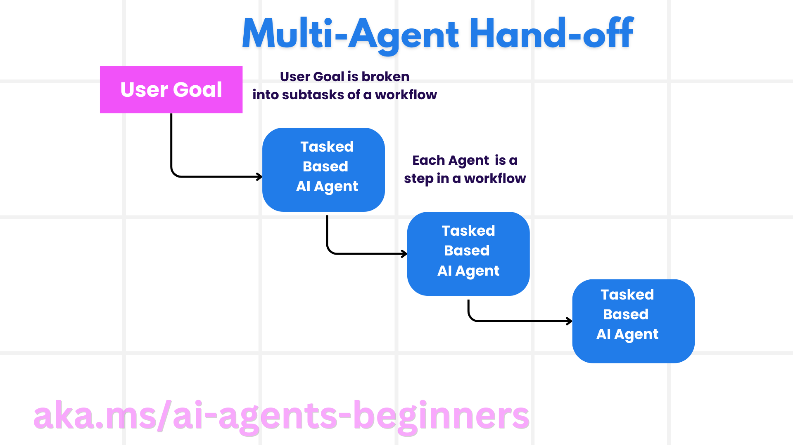

# 多智能体协作：角色、通信与工作流

## 学习目标与准备

完成本章后，你应能判断何时需要多个智能体，为角色划分工具与权限，比较群聊、交接、协同推荐以及顺序、并行、条件工作流，并设计可观测的客户支持流程。

先掌握[规划设计](07-concepts.zh-CN.md)和[行动边界](06-concepts.zh-CN.md)。纸面练习无需云账号；代码实践按[环境准备](00-setup.zh-CN.md)使用 Windows PowerShell 7、Python 3.12+、`agent-framework-core==1.10.0`。本章依据[第 08 模块原文](https://github.com/deepenable/ai-agents-for-beginners/blob/25b7985f3b2dc37a84f4a7387ccd3c9f0e5b1595/08-multi-agent/README.md)和[Workflow 配套教程](https://github.com/deepenable/ai-agents-for-beginners/blob/25b7985f3b2dc37a84f4a7387ccd3c9f0e5b1595/08-multi-agent/code_samples/workflows-agent-framework/README.md)，具体 API 以同提交代码为准。

## 先证明单智能体不够

多智能体是多个具有不同职责的单元围绕共同目标协作的设计模式，并不等于启动越多模型越好。适用动机通常有三类：

- **大工作量可分割**：不同资料或数据分片可以独立处理，再合并结果。但大量相同分类请求通常先解决吞吐和扩容，不必创造不同角色。
- **任务复杂且有明显阶段**：旅行的航班、住宿、预算由不同能力完成；内容处理可分起草、审核和发布。
- **需要不同专长或权限**：退款涉及支付、反欺诈和合规，角色需要各自工具和审计边界。机器人、自治系统与医疗协作也体现此思想，但本课程不实施这些高风险系统。

若一套指令、一组工具就能完成任务，单智能体往往更容易测试、观察和维护。多个工具并不自动要求多个智能体。

多智能体的收益是专业化、模块化扩展和潜在的故障隔离；代价是额外模型费用、上下文传递、协调延迟、状态一致性和更多失败路径。“一个角色失败其他继续”不是自动保证，必须设计超时、部分结果和恢复策略。

## 六个构建要素

### 通信：谁需要知道什么

航班角色与酒店角色需要共享确定的日期和人数，不一定需要共享证件或支付资料。消息应区分用户约束、已核实事实、模型建议、工具错误和审批状态；不要把上游文字视为可信命令。

上下文过少会丢失预算，上下文全量广播又增加泄露与 token 成本。为每条边定义最小消息契约，比把整段聊天记录任意复制更可靠。

### 协调：谁负责推进和结束

集中式协调者负责派工、汇总和停止；分散式角色直接交互，灵活但难以统一约束；混合式可在阶段内并行，在关键写入前集中审核。任何方式都需要完成条件、轮数或时间预算、异常状态和人工升级入口。

### 内部架构：角色不只是名字

一个专家的有效边界由指令、模型、工具、状态和权限共同决定。“预算审核员”若没有价格资料，只能检查估计的一致性，不能核验实时报价。让多个同样的模型互相赞同，不会自动获得独立证据。

### 可见性：还原协作过程

日志至少连接一次用户请求、执行者、动作、输入类别、输出状态和时间。工作流图解释允许的路径；trace 解释本次实际走过的路径；性能指标解释哪类路径最慢、最贵、最常失败。

对于旅行方案，可分别观察计划、礼宾建议、预算审查三个输出；不能只看到最终摘要就断言前两步有效。日志需要脱敏，不记录证件、完整收据或令牌。

### 模式：选择合适的互动结构

固定顺序适合明确依赖，并行适合真正独立的工作，条件路径适合规则分流。群聊与交接解决的是角色交互方式，图工作流解决的是具体执行路径，两者不是完全同一分类维度。

### 人在回路：只在必要处让人决策

人工可以补足需求、仲裁分歧或批准高风险操作。预算审核员输出 “approved” 不是人的付款授权。真实预订、退款、公开发布前仍要应用级审批，不能把另一个模型当作用户。

## 三类多智能体交互模式

### 群聊

多个角色通过共享消息讨论问题，可由中央管理者决定发言顺序，也可通过分布式协议通信。适合协作、客服分析和共同评审。关键是控制谁能发言、何时结束、如何处理分歧和重复讨论。无限轮询或彼此复述会增加费用而不增加信息。

### 任务交接

每个角色负责一个阶段，将产物和状态交给下一个角色。客服从分诊到专家解决，内容从起草到审核，都适用此模式。交接不是简单转发文本：接收方需要知道哪些事项已完成、哪些仍是假设、有没有得到授权。

### 协同推荐

多个专家对同一候选提供不同维度的意见，再形成建议。原文用行业、技术分析和基本面专家共同评估投资标的说明多视角协作；这只是结构示例，不是投资建议，也不实施交易。本课程可用旅行的文化体验、预算和交通便利性替代高风险金融任务。

这里的“协同过滤”强调专家意见协作，不等同于传统推荐系统的用户—物品矩阵算法。汇总时需保留分歧和证据，不应把多数意见当作事实。

## 工作流架构与三种执行模式

Workflow 教程用类似 Pregel 的 superstep 思想解释图式执行：执行单元处理收到的消息，沿边发送，运行时协调下一步。学习时要分清三个部件：

- **Executor**：处理单元，可以是智能体，也可以是普通确定性函数；处理器可按消息类型分派。
- **Edge**：消息路径，可顺序连接、扇出或带条件。
- **Workflow**：组织执行、状态与事件输出，不负责自动保证业务事实正确。

### 顺序

主 notebook 是 `TravelPlanner → TravelConcierge → BudgetReviewer`；基础变体是 `FrontDesk → Concierge`；家具变体是 `Sales-Agent → Price-Agent → Quote-Agent`。前一个阶段的产物成为下一个阶段的上下文，适合逐步增强。

固定图保证预设路径，不保证生成内容可重复，也不自动增加审批检查点。家具价格在没有市场工具时只是估计，必须标明不是商家报价。

### 并行

`InputDispatcher` 将同一个 Seattle 旅行请求发送给研究员和规划员，两个输出执行者分别返回结果。它可以减少等待，但模型调用总量不一定减少，也不保证线性加速。

当前 Python 并行变体没有“研究结果 → 规划员”的边，因此规划员不能真的依赖尚未完成的研究。结果列表只是并列收集，不是额外模型的综合结论。若业务要求“先研究后规划”，应改为顺序或在并行后增加明确汇总阶段。

### 条件

内容生产变体尝试“起草 → 审核 → Yes 发布／No 返回意见”。`ReviewResult` 承载结果、理由、原稿；`select_targets` 或 .NET 的 `GetCondition` 选择分支。源代码没有拒绝后自动回到起草的边，也没有明确规定恰好 200 词如何处理，不能声称它已经具备完整修订循环。

此变体仍含旧 SDK/API 和额外 Bing、托管代码解释器需求，详见[实践的兼容性分支](08-practice.zh-CN.md)。本课程保留其分支设计教学，但不将其标为当前锁定环境可直接全量运行。

## 案例：退款与客户支持如何分工

退款专用角色可包括客户代表、卖家处理、支付退款、问题解决、合规。通用能力还包括退货运输、反馈、升级、通知、分析、审计、报告、知识维护、安全和质量检查。这些都是职责候选，不要求一项职责部署一个模型；确定性校验与后台服务通常更适合金额计算和权限检查。

客户支持的参考解还增加支持处理与培训角色：前者回答或执行支持任务，后者整理获准使用的去敏案例来改进人员或智能体能力。知识维护更新资料，质量角色评估回答，审计保留不可变证据，合规决定政策边界，不能让同一“审核员”既修改证据又裁定通过。

设计退款路径时，要把建议与真实退款分开。支付角色只能接受已验证的订单归属、金额和批准状态；通知角色只接收必要的状态摘要。分析和训练默认使用去敏数据，不能任意复制客户对话。

## 动手活动：交付一张客服协作表

离线完成以下步骤：

1. 选“客户申请退货但超过常规期限”作为虚构案例，列出入口、支持、知识、合规、升级、支付、通知与审计职责。
2. 每个职责填写输入、输出、工具权限、超时后动作和可见日志字段。
3. 画出成功、拒绝、需要人工补充资料三条路径；把退款执行放在批准之后。
4. 让知识查询失败一次，说明是返回部分结果、使用可信备用知识还是停止，不能让支付继续。
5. 与[客服参考解](https://github.com/deepenable/ai-agents-for-beginners/blob/25b7985f3b2dc37a84f4a7387ccd3c9f0e5b1595/08-multi-agent/solution/solution.md)对照，检查反馈、质量、安全、培训等横向职责是否被考虑，而不是比较角色数量。

自测：需要独立反欺诈、支付和合规权限的退款流程适合多智能体；单知识库 FAQ 或大量相同分类未必适合。一套指令和工具足够、无需专家交接时优先单智能体。理由对应[源测验答案](https://github.com/deepenable/ai-agents-for-beginners/blob/25b7985f3b2dc37a84f4a7387ccd3c9f0e5b1595/08-multi-agent/solution/solution-quiz.md)。

## 预期结果、问题处理与风险

合格设计应解释每个角色存在的必要性，显示消息边界、终止规则、失败路径与人工批准点。若无法说明两个角色有什么不同，合并它们；若出现无尽群聊，明确结果格式和停止预算；若角色之间丢失约束，补齐消息契约，而不是无限追加上下文。

本章不调用云端，无模型费用。未来执行多个角色会叠加调用费用与限流风险；条件发布还可能使用付费搜索、托管计算和远端文件存储。接入真实退款、发布或客户数据前必须取得授权并配置审批，不能用生产数据演练。

## 清理与演练状态

只保留去敏角色表和流程图，删除真实订单、联系方式或凭据。未运行代码时没有云资源需要清理；进入实践后按分支登记和清理实验对象，不能删除共享服务。

**教学演练状态：待演练。** 设计讨论不代表工作流容错、扩展性能或外部集成已经验证。
