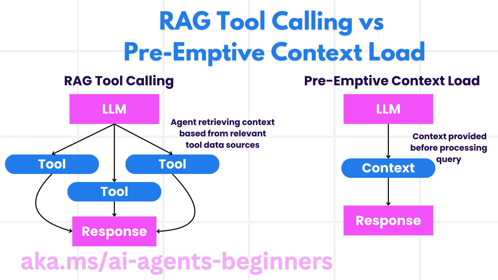

# 元认知设计：依据证据反思、检索与修正策略

## 学习目标与准备

本章把“思考自己的思考”落实为可观察的工程行为：检查目标与证据、发现错误、选择备用策略、评估输出并限制修订成本。完成后，你应能区分反思、规划、纠正性 RAG 和代码工具，设计一个不会无限自我循环的旅行助手。

先阅读[规划设计](07-concepts.zh-CN.md)和[多智能体协作](08-concepts.zh-CN.md)。概念活动只需纸面或本地 Python，不需要云资源。配套实践按[环境准备](00-setup.zh-CN.md)使用 Windows PowerShell 7、Python 3.12+、`agent-framework-core==1.10.0`。

依据：[第 09 模块原文](https://github.com/deepenable/ai-agents-for-beginners/blob/25b7985f3b2dc37a84f4a7387ccd3c9f0e5b1595/09-metacognition/README.md)。原文包含多个说明性类与未实现的函数；本章保留其设计主题，但不把伪代码包装为已可运行的服务。

## 元认知的工程含义与限度

对智能体而言，元认知可以表现为监控自己的产物、发现证据不足、承认错误并调整解决方法。例如旅行助手原本只按低价选酒店，用户反馈质量差后，不只是替换一家酒店，还修订“先满足质量底线，再按预算排序”的策略。

这不要求证明模型具有人的自我意识，也不要求暴露模型内部思维过程。应关注外部可验证记录：尝试了哪个工具、收到什么错误、为何改用备用来源、哪些证据支持最终建议。模型生成一段听起来合理的自我评价，不等于真实检测到了问题。

元认知的价值体现在：

- **透明性**：明确说明来源、假设、失败和回退，而不是伪造成功。
- **推理与纠错**：比较目标和结果，识别遗漏与矛盾。
- **适应与感知**：根据新约束、工具状态和环境数据改变策略。
- **资源管理**：决定何时继续搜索、何时停止、何时求助，避免无收益循环。

## 角色、工具、技能如何形成专业单元

角色设定决定与用户沟通方式；工具决定能执行的动作；技能是领域知识与处理方法。三者共同构成有边界的专业单元。旅行专家角色不能代替真实航班数据库，工具能返回价格也不意味着模型可以自行付款。

一个完整旅行服务可按以下步骤组织：

1. 收集日期、预算、兴趣、人数和特殊需求。
2. 检索航班、住宿、景点与餐馆资料。
3. 形成初始推荐，注明信息有效时间与假设。
4. 展示行程，收集用户赞同和不喜欢的部分。
5. 根据反馈改变选择策略并更新方案。
6. 获得最终确认，再进入有独立审批的真实预订。
7. 提供行前与旅途支持，重新核验变化。

所需资源包括旅行数据、目的地知识和获准保存的反馈记录。源 `Travel_Agent` 中的 `user_preferences` 和 `experience_data` 表达这些状态；它们只是内存变量，没有自动学习、跨会话存储或隐私同意机制。

## 规划与反思循环

开始迭代前先确定当前任务、完成步骤、可用资源、过去经验和停止条件。若目标是“在预算内最大化满意度”，必须同时定义满意度证据与预算边界，不能每轮只挑“看起来更好”的项。

源原文的 `bootstrap_plan` 按偏好与预算筛选初始目的地，`match_preferences` 比较属性，`iterate_plan` 尝试替换，`calculate_cost` 估算成本。它们展示目标引导的迭代，而不是通用优化算法：替换时应计算“原总额减去被替换项加上新项”，不能把新项重复加到原总额；没有明确评分也无法证明新计划更优。

设计循环时保留旧计划、变更理由和新证据。发现已满酒店应重新查可用性，不应仅改写描述；用户不喜欢拥挤，应调整排序标准、时间段或候选来源，而不只是删除一个景点名称。

## 纠正性 RAG 与预先加载上下文

### 按需检索

RAG 先从知识库或外部来源取相关资料，再将资料交给生成模型。优点是可按问题选择数据、更新及时；代价是工具延迟、检索失败和来源质量风险。

纠正性 RAG 在此基础上增加评估与修订：发现资料不相关、过时或与用户反馈冲突，就改写查询、筛选候选、重新检索，再评估。旅行例中，用户说埃菲尔铁塔太拥挤，可以把“避开拥挤”加入约束，重查景点与访问时间，再验证新建议是否真正满足约束。

### 预先加载

预先把巴黎、东京、纽约或悉尼的国家、语言、货币、常见景点放入上下文，可减少简单查询的检索延迟。源 `TravelAgent.context` 字典和 `get_destination_info` 展示这种方式。

它适合小而稳定的知识，不适合实时航班、房态或价格。上下文过大会增加 token 成本，旧资料也会持续污染回答。混合设计可预载稳定政策，动态查询时效性资料；不要把“已加载”误认为“仍然正确”。

### RAG 是提示技术，也是工具系统

作为提示技术，开发者明确组织“查什么、怎样使用检索结果”；控制细，但需要维护查询与提示。作为工具系统，代理调用封装好的检索、排序、引用流程；更易复用，但必须理解工具的检索范围、更新频率和失败行为。

源 `search_museums_in_paris` 与 `RAGTool.retrieve_and_generate` 是两种抽象的示意；代码中未提供完整 `search_web`、`RAGTool` 实现，不能直接运行获得博物馆数据。

## 相关性评估、重排与搜索意图

### 相关不等于真实

评估至少考虑上下文、事实准确性、用户意图和反馈。一个餐馆很符合口味，却已停业；另一个便宜却不在目的地。应先用硬约束过滤，再按偏好评分。

原文的 `relevance_score` 按兴趣、预算、位置加分，`filter_and_rank` 排序取前十；这是透明、便于测试的基线。需要一致的数据类型：不能拿数字价格与字符串 `"moderate"` 比较。得分高也不自动证明事实更新，应核验来源和有效时间。

NLP 可抽取地点、日期、预算和情绪；用户反馈可调整权重。不要机械地把所有 “disliked” 永久拉黑：用户可能只是不喜欢某时间段拥挤，或者本次预算较低。

### LLM 重排与评分

先检索候选，再由 LLM 按明确准则排序或打分，能处理较复杂的语义偏好。必须给评估模型可核验的候选资料和量表，并与简单规则或人工标注对照；模型评分会有波动、偏好和费用。

原文的旧 HTTP completions 片段使用占位认证与旧响应格式，仅用于说明，不是本课程操作命令。实际实验用固定 notebook 的 Foundry `ResponseEvaluator`，不会另建旧 API 路线。

### 三种搜索意图

| 意图 | 旅行问题 | 合适动作 |
| --- | --- | --- |
| 信息性 | 巴黎有哪些博物馆？ | 检索并解释，附时效与来源 |
| 导航性 | 卢浮宫官方网站在哪里？ | 返回核验后的官方入口，不编造链接 |
| 交易性 | 帮我购买门票 | 先澄清条件、检查权限和审批，不能仅因出现“购买”就付款 |

源 `identify_intent` 以 `book`、`purchase`、`website`、`official` 等英文关键词分类，只是基线；不能准确处理中文、否定句或混合意图。`analyze_context`、用户历史与个性化有助于判断，但历史不是当前授权，也不应跨用户共享。

## 代码生成与 SQL 检索的边界

代码生成智能体可为数据分析生成加载、过滤、聚合和图表代码，也可根据数据库 schema 生成查询。环境感知意味着知道表、列、类型、单位、权限和可用工具，避免凭空引用字段。反馈后应更新真实存在且语义匹配的字段，而不是把任何喜好词映射到任意列。

源原文展示生成航班和酒店代码、执行后组装行程、反馈后再生成的过程。其中 `exec(code)`、虚构 HTTP 服务和动态字符串 SQL 都是教学示意，不能在有凭据的本机直接执行模型生成代码。

安全执行需要隔离环境、无秘密、受限文件与网络、资源限额、人工审查和停止机制。SQL 作为 RAG 时，应先提供只读 schema，再限制允许表列、使用参数化值、限制返回行数。表名和列名不能通过普通参数占位解决，仍需白名单。不要把检索工具变成任意数据库管理工具。

本模块实践不需要创建 `travel.db`，也不执行生成的代码或 SQL。若未来扩展，先用内存合成数据和只读工具验证，而不是连接财务或订单数据库。

## 酒店策略切换的可解释反例

原文 `HotelRecommendationAgent` 保存 `previous_choices` 与 `corrected_choices`，用 `recommend_hotel` 在 `cheapest` 与 `highest_quality` 间选择，再由 `reflect_on_choice` 读取 `get_user_feedback` 的结果。

样例把低于 100 的价格或低于 7 的质量视为 “bad”，使最便宜酒店触发策略切换。这是人为定义的反馈，不是真实用户评价，也不能推断便宜就不好。示例最后显式再次传入 `highest_quality`，并不是系统自动执行了反思建议。

教学价值在于把“选择策略”和“评价策略”显式分离。真实设计更应先满足质量下限与预算，再选择最优候选，避免在“最便宜”和“最高质量”之间来回摆动。一次修订没有改善就应保留失败说明或请人决策。

## 动手活动：给一个错误推荐建立纠错闭环

使用虚构场景：两位旅客想在巴黎参观博物馆，预算有限且不喜欢拥挤；初始计划只按热门榜单推荐。

1. 写出当前目标、硬约束、已有证据与未知信息。
2. 将信息分成可预载的稳定知识和必须重新检索的时效资料。
3. 判断用户是在问信息、找官网还是授权购票；只给前两者安排只读动作。
4. 定义三条评分标准，至少一条采用可直接计算的硬约束；不要全依赖模型自评分。
5. 写出一次修订：改变检索词、访问时间或排序依据，说明需要什么新证据。
6. 加入上限：最多两次检索，仍无可靠资料时明确缺口并停止；真实购票另走人工批准。

预期产物是“目标 → 证据 → 失败 → 策略变化 → 复验 → 停止条件”的记录，而不是一段自我表扬。若只修改回答措辞，补充真正改变的查询或工具；若评分很高却没有来源，标为证据不足；若历史偏好覆盖本次需求，以用户最新明确约束为准。

## 风险、清理与演练状态

概念活动不产生云费用。真实重检索、评估模型和自我修订会增加请求量；设置预算和调用上限。反馈与行为日志可能含敏感偏好，需要同意、最小化保存与删除机制。不得在本机执行未经审查的生成代码，不得拼接用户输入直接查询生产数据库。

删除活动中误写的真实偏好或身份信息，只保留合成案例。未创建文件、数据库或云对象时无需额外清理。代码路线见[回退与评估实践](09-practice.zh-CN.md)。

**教学演练状态：待演练。** 本章没有验证真实旅行数据、生成代码执行环境或模型自我纠错效果。
