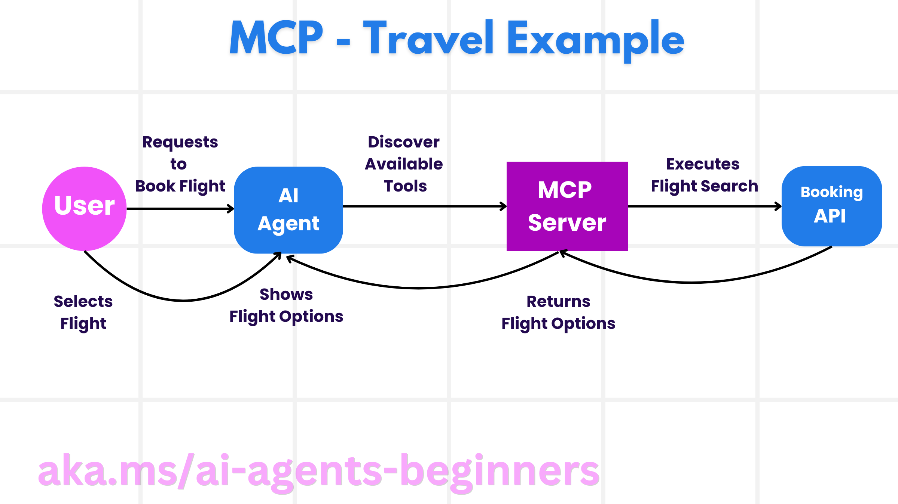
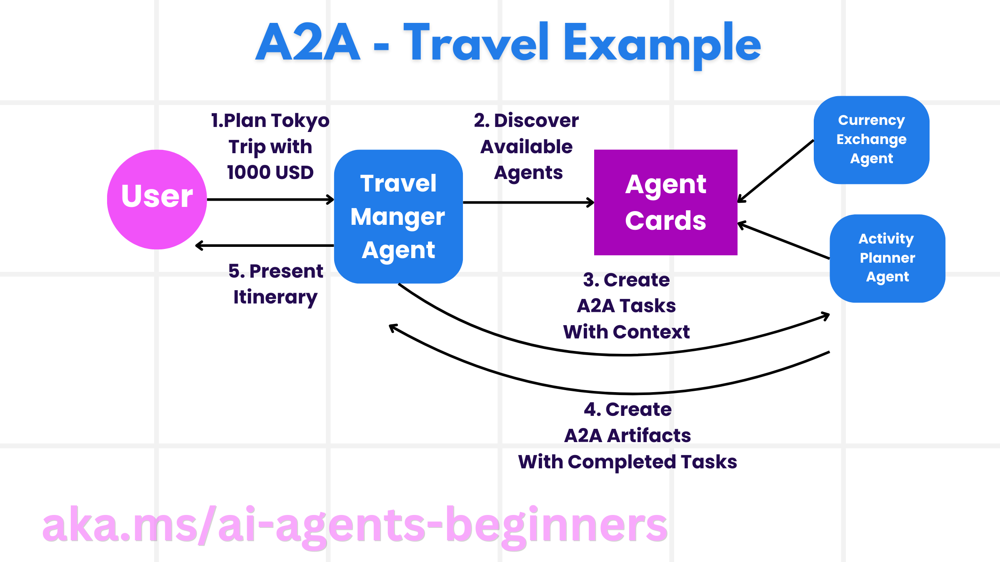

# 理解 MCP、A2A 与 NLWeb 的协作边界

## 目标与准备

本章面向已经理解工具调用与多智能体分工的学习者。完成后应能画出一次旅行咨询的协议边界，解释工具发现、任务委派和网站检索的差别，并从源码判断“模式模拟”与“真正的协议通信”。

阅读[环境准备](00-setup.zh-CN.md)。离线练习仅需 Windows、PowerShell 7 和 Python 3.12+，不需要 Azure 登录、GitHub 令牌或网络服务。后续实践使用固定版本 `25b7985f3b2dc37a84f4a7387ccd3c9f0e5b1595`，框架基线为 `agent-framework-core==1.10.0`。本章不运行模型，不创建预订，不授予权限。

主要依据：[英文原课](https://github.com/deepenable/ai-agents-for-beginners/blob/25b7985f3b2dc37a84f4a7387ccd3c9f0e5b1595/11-agentic-protocols/README.md)。协议能力是设计目标，不表示每个示例都实现了全部能力，也不表示启用协议就自动获得安全性。

## 从一次旅行请求理解三种协议

用户要求“安排一周东京旅行，兼顾餐饮、文化和预算”。系统可能同时需要三个不同接口：

| 需求 | 对端提供什么 | 更贴近的协议 |
| --- | --- | --- |
| 查住宿、读取取消政策、调用库存接口 | 有名字、参数与返回值的能力 | MCP |
| 把“制定文化行程”交给另一个组织的专家 | 能独立规划、执行并报告任务状态的智能体 | A2A |
| 用自然语言查询旅游网站自有目录 | 基于站点内容的检索和结构化回答 | NLWeb |

这些不是互斥选项。旅行经理可以通过 A2A 委托酒店专家，酒店专家再通过 MCP 访问库存，或把网站的 NLWeb `ask` 能力作为 MCP 工具使用。选择时先确定**对端负责什么**，而不是根据“是否含有 LLM”给服务贴标签。

直接 API 仍然合理：只有一个稳定后端、固定参数且需要强事务语义时，显式 API 集成可能更简单。协议主要减少不同工具或智能体之间的集成差异，不负责替业务系统实现库存锁定、退款规则或账务一致性。

## MCP：统一暴露工具、资源和提示模板

### 主机、客户端与服务端

主机是用户操作的应用，例如编辑器或旅行助手；客户端是主机内部连接 MCP 服务的组件；服务端暴露某一组能力。一个主机可以管理多个客户端连接，每个客户端连接对应一个服务端。



图中的“AI Agent”简化了主机与客户端两个角色。真正发送协议请求的是运行时客户端，不是模型自行打开网络连接。

MCP 的三个基本能力不能混为一谈：

| 能力 | 旅行场景 | 使用约束 |
| --- | --- | --- |
| Tools | `search_flights`、`book_flight` | 可能产生副作用；名称、描述和参数模式必须清楚 |
| Resources | 取消政策、账单只读副本、说明文档 | 读取也需要授权；内容不因此变成可信指令 |
| Prompts | “比较三种行程”的预设模板 | 是可复用交互材料，不是自动获得执行权限 |

### 一次调用的完整链路

1. 主机选择已批准的服务，客户端建立连接并协商能力。
2. 客户端取得工具列表和模式，而非凭模型记忆猜工具名。
3. 应用筛选本任务允许使用的工具，再把描述交给模型。
4. 模型提出调用，例如目的地、日期、人数。
5. 应用校验参数与权限；涉及付款时先取得明确审批。
6. 服务端调用真实业务 API，再把结果返回给客户端。
7. 主机把结果作为数据交给模型生成解释；业务回执才是预订证据。

动态发现减少了每个工具都手写适配代码的负担；模型可替换提高了互操作性；规范化认证有利于统一管理远端访问。但本地 stdio 服务、回环地址测试服务和生产 HTTP 服务的认证配置并不相同。工具发现成功不等于工具调用已获授权，认证成功也不等于该用户能读取所有资源。

### MCP 能否承载长任务

可以，但要组合多种能力。[长任务说明与源码](https://github.com/deepenable/ai-agents-for-beginners/blob/25b7985f3b2dc37a84f4a7387ccd3c9f0e5b1595/11-agentic-protocols/code_samples/mcp-agents/README.md)展示：

- **进度与部分结果**：进度通知说明执行到哪里；资源更新可提示读取新结果。通知不是第二个 JSON-RPC 最终响应。
- **恢复**：Streamable HTTP 使用会话标识、事件标识和事件存储进行重放。恢复连接与重跑业务动作不同，重复付款必须另有幂等机制。
- **持久性**：资源链接可以指向持续更新的结果；真正跨进程恢复仍需要持久化任务、会话及结果。只有一个内存事件数组不够。
- **Elicitation**：服务端请求宿主向人类收集确认或补充信息。适合询问“是否接受此价格”，不应用来索取密码。
- **Sampling**：服务端请求宿主提供模型能力。宿主决定是否允许、用哪个模型以及能发送哪些数据；它不是服务端绕过预算的通道。

本地样例的 research sampling 回调返回固定模拟文字，不调用 LLM。默认 `SimpleEventStore` 只存于内存。源码虽有 SQLite `PersistentEventStore`，默认启动函数没有选择它；事件落盘本身也不意味着正在执行的 Python 任务可在服务器重启后继续。

## A2A：把任务交给具有自治能力的对端

### 发现、执行、成果与进度

A2A 的目标是让不同组织、框架和模型构建的智能体交换任务，而不是要求它们公开内部实现。



- **Agent Card**：声明名称、用途、技能、服务端点、版本和能力，如流式结果或推送通知。应从可信来源取得卡片并检查认证要求；卡片是能力声明，不是能力已验证的证明。
- **Agent Executor**：在服务端接收任务和必要上下文，调用对端自己的模型、工具或业务逻辑。不要把全部聊天记录无条件转发给每个合作方。
- **Artifact**：任务的工作成果，例如行程 JSON、候选航班清单或报告。可包含多个部分；它不是任意一条聊天消息，也不能仅因文字写着“完成”就当成有效预订。
- **Event Queue**：协调状态变化、进度消息和结果交付，尤其适合长任务。队列可帮助解耦执行与传输，但不会保证网络永不掉线。

典型任务经历提交、执行、完成或失败；有些任务还需要补充输入或取消。连接生命周期与任务生命周期应分开理解：得到一个 Artifact 不意味着协议要求立即关闭所有连接。

### 为什么不仅仅把远程智能体当函数

“查某天汇率”接近确定性工具调用；“在预算内优化七天计划并解释取舍”可能涉及多轮规划、询问和长任务状态。A2A 让后者以任务为中心暴露能力，对端可自主选择模型与工具。它改善跨框架合作、模型选择与服务边界，但跨组织认证、最小上下文、超时、重试和费用归属仍须双方明确约定。

源码的 A2A notebook 并未发布 Agent Card 或使用远程 A2A 客户端。它用 `WorkflowBuilder` 把 `CurrencyExchangeAgent`、`ActivityPlannerAgent`、`TravelManagerAgent` 顺序连接，是**进程内协作的教学模拟**。不得把输出中的三个名字当作三个独立 A2A 服务的证据。

## NLWeb：把网站内容变成可查询的自然语言接口

### 内容进入系统后发生什么

NLWeb 把网站已有的商品目录、文章、RSS 或 Schema.org 数据组织成可检索内容。其核心应用协调查询理解、检索、回答组织；协议定义自然语言交互和 JSON 响应；MCP 入口让其他智能体也能访问站点的 `ask` 等能力。

嵌入模型把内容转成向量，向量数据库保存并检索这些表示。可选择 Qdrant、Snowflake、Milvus、Azure AI Search 或 Elasticsearch 等后端，但不同后端的部署、过滤能力、权限和成本不能视为完全等价。

一个“东京适合家庭且有游泳池的酒店”请求通常经过：

1. 摄取站点目录并保留条目 ID、更新时间与来源。
2. 为目录建立嵌入与索引，记录嵌入模型版本。
3. 理解查询中的城市、家庭、泳池和日期条件。
4. 检索候选条目，并检查结构化条件，不只按语义相似度排序。
5. 让模型基于候选内容组织回答，附上目录来源。
6. 如需实时房态，再调用库存服务；历史网页不等于实时可订。

站点内容约束能降低虚构风险，但不能保证模型永不出错。检索不到餐厅时应回答“目录中无相关证据”，不能把旅行常识包装成站点已收录事实。网站也可能含恶意指令，必须保持数据与执行规则隔离。

此固定提交没有可运行的 NLWeb 服务样例；本模块提供可检验的设计练习，不编造部署命令或声称已经接通 NLWeb。

## 离线练习：为请求分配协议与证据

### 步骤一：检查样例是否真的跨服务

工作目录为按环境准备取得的**源码仓库根**。以下 PowerShell 只读取 notebook JSON，不执行代码、不读取环境文件：

```powershell
$nb = Get-Content .\11-agentic-protocols\code_samples\11-a2a-agent-framework.ipynb -Raw | ConvertFrom-Json
$code = ($nb.cells | Where-Object cell_type -eq 'code' | ForEach-Object { $_.source -join '' }) -join "`n"
[pscustomobject]@{
    HasWorkflowBuilder = $code.Contains('WorkflowBuilder')
    HasAgentCard = $code.Contains('AgentCard')
    HasA2AAgent = $code.Contains('A2AAgent')
}
```

预期为 `True、False、False`。这是当前文件的静态证据，而不是通用判定算法；别的代码可能用不同符号实现相同协议。

### 步骤二：写出三个接口契约

在自己的实验记录中设计以下三个契约，不写真实姓名、账户、票号或令牌：

| 接口 | 必须写出的内容 | 合格判据 |
| --- | --- | --- |
| 住宿查询 MCP 工具 | 城市、入住/离店日期、人数、币种、库存时间戳 | 查询与预订分开；日期先后与人数有约束 |
| 行程规划 A2A 任务 | 任务 ID、预算、技能、状态、超时、Artifact 结构 | 能区分待输入、失败和完成；不把整段聊天无条件外发 |
| 网站 NLWeb 查询 | 目录条目 ID、过滤条件、来源、无结果策略 | 每个推荐可追溯；无实时库存时明确限制 |

再画出“用户拒绝确认”“服务超时”“站点无数据”三个反例。每个反例都应有停止或降级路径，不能无限重试或自动批准。

### 步骤三：解释需要保留什么

回答：断线后为什么仅重发 `book_flight` 危险？合格答案应包含任务/请求标识、幂等键、已提交动作记录和业务状态查询。再回答：只保存最后事件 ID 为什么不能恢复服务器内存中丢失的工作？合格答案应区分**事件重放、任务执行状态、业务结果持久化**。

## 常见误区与恢复

| 现象 | 应如何重新判断 |
| --- | --- |
| 看到 `@tool` 就认为用了 MCP | 找客户端连接、初始化、`list_tools`、`call_tool`；本地函数不是传输协议 |
| 看到多智能体就认为用了 A2A | 找 Agent Card、远程端点与任务协议；`add_edge` 只能证明图中存在边 |
| 把进度 100 当成业务成功 | 核对最终结果和业务回执；模拟文字不能证实付款或预订 |
| 认为 NLWeb 回答必然真实 | 查原目录、检索结果和更新时间；无证据时返回未知 |
| 认为协议自带完善安全 | 检查实际部署的认证、授权、工具审批与数据边界 |

## 验证记录与清理

应产出一张协议边界图、三个接口契约和三个异常路径，且能指出两个 notebook 的模拟范围。本文完成的是固定版本源码的本地审阅；教学演练状态为**待演练**，未进行 MCP 网络连接、A2A 远端联调、NLWeb 部署或付费调用，未执行平台正式校验。

本章命令不创建资源，无需删除云服务。保留去敏设计记录，移除误写的真实数据；不要删除共享源码。接下来用[协议实践](11-practice.zh-CN.md)检验这些边界。
