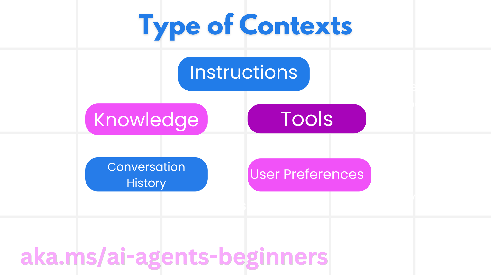

# 设计可选择、压缩与隔离的智能体上下文

## 目标与准备

本章把“写一个好提示”扩展成“为下一次模型调用准备正确的信息”。完成后应能为旅行助手绘制上下文管道，为信息分配写入、选择、压缩、隔离策略，并用不含原始敏感文本的记录排查错误。

前置知识是消息、工具、会话与 RAG。阅读[环境准备](00-setup.zh-CN.md)；离线练习使用 Windows、PowerShell 7、Python 3.12+，不需要云账号。实践章沿用 `agent-framework-core==1.10.0` 和固定源提交 `25b7985f3b2dc37a84f4a7387ccd3c9f0e5b1595`。依据为[上下文工程原课](https://github.com/deepenable/ai-agents-for-beginners/blob/25b7985f3b2dc37a84f4a7387ccd3c9f0e5b1595/12-context-engineering/README.md)。

本章只处理合成旅行数据。连接日历、邮箱、长期记忆或远端工具之前，必须取得相应用户授权和最小访问权限；不能把“更懂用户”当作读取全部个人数据的理由。云模型、检索和摘要均可能收费，离线设计不产生这些费用。

## 上下文工程解决什么问题

提示工程主要设计指令：角色是什么、回答遵循什么规则、如何使用工具。上下文工程管理整个动态输入：哪些消息留下、哪些知识检索进来、哪些工具可见、哪些旧事实被替换、哪些大结果留在窗口外。

一个提示可以一直不变，但用户需求、工具输出、检索材料与会话历史每轮都在变化。窗口足够大不代表信息质量就好；过期、矛盾或不可信的信息即使只有几句话，也可能让下一步行动失误。

应把每次调用视为受预算约束的输入集合：

```text
本轮输入 = 稳定规则 + 当前目标 + 已确认状态
         + 相关知识/记忆 + 最少工具定义 + 必要的近期消息
```

预算不仅是 token 数，还包括响应延迟、数据权限和模型注意力。允许输入的总量必须给输出、工具返回和继续交互预留空间。字符数不是 token 数；不同语言、模型分词器和工具模式都会改变实际开销。

## 五类信息如何进入上下文



| 类型 | 旅行例子 | 管理重点 |
| --- | --- | --- |
| 指令 | 不替用户付款；回答提供来源；工具描述 | 版本化、保持规则优先级，不把检索文本当规则 |
| 知识 | 城市交通、酒店政策、RAG 文档 | 来源、更新时间、访问范围、检索相关性 |
| 工具 | 住宿查询的模式与返回结果 | 最小工具集合、结果大小、调用权限和错误状态 |
| 对话历史 | 用户前几轮的需求与修订 | 哪些消息仍必要、摘要是否保留否定和变化 |
| 用户偏好 | 预算、住宿类型、饮食喜好 | 同意、适用范围、有效期、当前任务是否覆盖旧偏好 |

同一信息可扮演不同角色：历史中的“更喜欢直飞”经确认后可以成为长期偏好，但必须保留来源和更新机制；不能把一句试探性问题自动升级为永久事实。

## 先规划结果，再规划上下文管道

### 定义明确结果

不要只写“帮用户安排好旅行”。可验证目标是：“给出十月日本十日单人行程草案，预算不超过合成的 3000 美元，偏好传统旅馆，不发生预订。”这能指导什么信息必须存在，也能限制不必要的工具。

### 映射信息来源

逐项回答“从哪里获得”：

- 日期、人数与预算来自本轮用户确认，不从模糊历史猜测。
- 用户长期偏好来自得到授权的记忆存储，但可被本次明确选择覆盖。
- 酒店库存与价格需要实时工具；模型常识或旧网页不够。
- 法规、签证等时效信息需要可靠资料与更新时间，不由行程生成者凭印象决定。

### 建立管道

合理的管道是“获取 → 校验 → 标记来源与权限 → 筛选 → 压缩 → 组装本轮消息 → 检查结果”。例如 RAG 候选先按用户权限过滤，再按城市和日期过滤，最后按相关性排序。向量相似度高不代表访问获准，来源可信也不代表内容仍然有效。

## 写入、选择、压缩、隔离四种操作

### 写入：让重要状态有明确位置

**Scratchpad（任务便签）**保存当前任务的决定、未解决问题和步骤结果，通常在窗口外的文件或运行时对象中。模型需要时只读相关部分，不把每次思考全过程都写入。它适合“本次行程已经确定十月，仍待确认城市分配”。

**跨会话记忆**适合长期偏好与反馈，例如“通常偏好公共交通”。写入前要判断是否值得保留、用户是否同意、多久失效。便签是任务状态，长期记忆是跨任务资产；一个文件保存到磁盘并不会自动变成合格的长期记忆系统。

**运行时状态对象**适合强类型、可校验的事实：`destination`、`budget`、`currency`、`month`、`revision`、`pending_questions`。它允许工作流在子步骤之间共享结果，而不是让模型从长聊天里重新推断。复杂任务中把每步的输入和输出绑定到任务 ID，防止混入另一个用户或另一次行程。

### 选择：只把本轮需要的内容送进去

知识、记忆、历史和工具都需要选择。查询“如何在巴黎乘公交”时，可能只需要交通资料与公交工具，不需要订房、租车、汇款和付款工具。

可将工具描述建立可检索目录，再结合确定性白名单选择少量相关工具。原课提到少于约 30 个工具的经验建议，但它不是普适阈值；应根据模型、模式长度、任务覆盖率和调用误差测量。若只保留一个错误工具，同样会失败。

选择必须有可解释的拒绝理由，例如“跨用户”“资料过期”“城市不符”“当前步骤没有写权限”，不能只保存一个看不懂的分数。

### 压缩：保留约束，不只是缩短文字

截断适合移除明显过期片段，摘要适合把旧历史转为稳定事实。压缩时必须保留：

- 当前目标与不可违反的约束；
- 已确认事实及其来源；
- 否定条件，例如“不租车”“尚未授权预订”；
- 修订关系，例如十月替代四月；
- 待确认问题，不将未知补写为事实。

摘要本身可能产生幻觉。先验收摘要再替换旧上下文，保留能追溯的来源范围。若旧消息和摘要同时完整发送，下次输入未必变少；如果仅让智能体“更简洁”，更不能据此宣称实现了历史缩减。

### 隔离：把大工作放在合适边界

**多智能体隔离**让专家只接收自己的子任务与必要上下文，向上返回有界结果。分工可以减轻主窗口压力，但如果所有专家都收到全部历史，隔离优势会消失，还会扩大数据暴露面。

**沙箱隔离**适合运行代码、分析大文档或大量记录：在受限制环境中执行，返回统计结果和少量证据 ID。沙箱不等于任意执行模型生成代码；必须限制网络、文件、CPU、时间和可用凭据。

**卸载**把大工具输出保存在窗口外，返回摘要、位置标识和检索接口。它不是丢弃全部证据；需要能在发现错误时定位原结果，并遵守同样的访问权限与保留期。

## 检查下一次调用，而不是收集更多日志

最有效的问题是：“下一次模型到底得到过多、错误，还是缺失的信息？”无需记录整段提示、邮箱正文或工具结果。可使用如下去敏记录：

```json
{
  "task_id": "lab-trip-12",
  "strategy": "select-compress-isolate",
  "candidate_count": 8,
  "selected_ids": ["dates-v2", "budget-v1", "hotel-policy-7"],
  "excluded_policy_labels": ["superseded", "unrelated-city"],
  "summary_id": "summary-v2",
  "source_range": "turns-1-6",
  "raw_history_in_next_call": false,
  "isolated_result_count": 1,
  "redaction_status": "synthetic-only"
}
```

此处数值是格式示例，不是实测结果。生产记录可增加检索分数、估计 token 桶和策略版本；使用哈希时注意短小低熵内容可能被猜中，哈希不是匿名化保证。检索文档 ID 也可能敏感，应按日志访问权限管理。

检查选择时比较候选数量与选中 ID；检查压缩时对比来源范围、摘要 ID、输入估算和原文是否排除；检查隔离时确认大结果没有再次回流到主上下文。只记录“summary generated”无法证明摘要被使用。

## 四类失败与不同的修复方法

| 失败 | 旅行场景 | 诊断证据 | 修复 |
| --- | --- | --- | --- |
| 上下文中毒 | 模型杜撰直飞航线并写入便签，以后反复使用 | 事实没有可验证来源，却不断出现在后续输入 | 实时校验、隔离错误记录，必要时新建会话；先撤销错误记忆再检索 |
| 上下文分心 | 大量旧背包游闲聊压过本月订票目标 | 相关信息占比低，回答重复过时内容 | 摘要、剪枝、突出当前目标，重新评估保留窗口 |
| 上下文混淆 | 出行查询触发酒店预订工具 | 可见工具过多或描述重叠 | 工具检索与白名单，明确输入/用途，禁用无关写工具 |
| 上下文冲突 | 四月与十月、经济舱与商务舱同时被当成当前事实 | 新旧状态无修订标记 | 按范围与时间解决冲突，标明被替代项，仅注入生效状态 |

不要把所有失败都归结为 token 不够。扩大窗口不能修复虚假航线，也不能处理权限冲突；压缩错误事实只会让错误传播得更高效。

## 离线练习：构造一个可审计的状态修订

### 步骤一：执行确定性合并

工作目录为源码仓库根，命令只在内存处理合成数据，不联网：

```powershell
@'
facts = [
    {"id": "month-v1", "field": "month", "value": "April", "revision": 1},
    {"id": "budget-v1", "field": "budget_usd", "value": 3000, "revision": 1},
    {"id": "month-v2", "field": "month", "value": "October", "revision": 2},
]
state = {}
for fact in facts:
    old = state.get(fact["field"])
    if old is None or fact["revision"] > old["revision"]:
        state[fact["field"]] = fact
assert state["month"]["value"] == "October"
assert state["budget_usd"]["value"] == 3000
print({"selected_ids": sorted(x["id"] for x in state.values()),
       "superseded_ids": ["month-v1"]})
'@ | .\.venv\Scripts\python.exe -
```

预期只选择 `budget-v1`、`month-v2`。这演示相同字段内的修订规则，不是通用事实冲突解决器；跨用户或跨任务不能仅凭较新的时间覆盖。

### 步骤二：为六种实现策略分配职责

给定一份长行程资料，分别写出：

1. Scratchpad 存当前决定和待确认问题。
2. 长期记忆存用户同意保存的稳定偏好。
3. 摘要器保留预算、时间、禁止动作与未决事项。
4. 子智能体只拿交通子任务并返回不超过约定长度的摘要。
5. 沙箱处理原始表格，仅返回统计值与异常行 ID。
6. 运行时对象保存已校验字段及版本号。

每一项再写“谁能读、何时失效、下一次模型是否需要它”。六项全部有答案，才算设计完整。

### 步骤三：建立反例与验收表

加入“历史中有一个已被否认的航班”和“便签仍写四月”两个错误。分别写出中毒隔离与冲突剪枝后的选中 ID，并解释为什么“只增加摘要”不够。交付当前状态表、上下文管道图和一条去敏检查记录。

## 与当前源码的差距

[聊天摘要 notebook](https://github.com/deepenable/ai-agents-for-beginners/blob/25b7985f3b2dc37a84f4a7387ccd3c9f0e5b1595/12-context-engineering/code_samples/12-chat_summarization.ipynb)使用 `create_session()` 保持多轮上下文；`summarize_preferences` 只返回带 `[SUMMARY]` 的字符串。它没有读写便签、删除旧消息或自动按 token 阈值压缩。

[仓库便签示例](https://github.com/deepenable/ai-agents-for-beginners/blob/25b7985f3b2dc37a84f4a7387ccd3c9f0e5b1595/12-context-engineering/code_samples/vacation_agent_scratchpad.md)展示偏好与已完成任务的记录形式，但 notebook 未读取该文件，不能把已有内容当成自己刚运行生成的结果。[实践章](12-practice.zh-CN.md)会补一个明确标注的本地便签与新会话练习。

## 常见问题、记录与清理

若合并结果不正确，先核对工作目录、Python 内核和版本，再检查键名与 `revision`；不要把“较新”规则扩展到未获授权的数据。若摘要遗漏否定约束，应退回原信息重新生成或人工修订，不能继续执行预订。

本章应产出六策略分工表与可解释的选中状态。当前状态为**待演练**：仅进行本地源码审阅，未运行生产上下文检查、云模型或平台正式验证。离线命令不写文件或创建云资源；只需清理自己的含敏感数据草稿，保留去敏设计证据。
