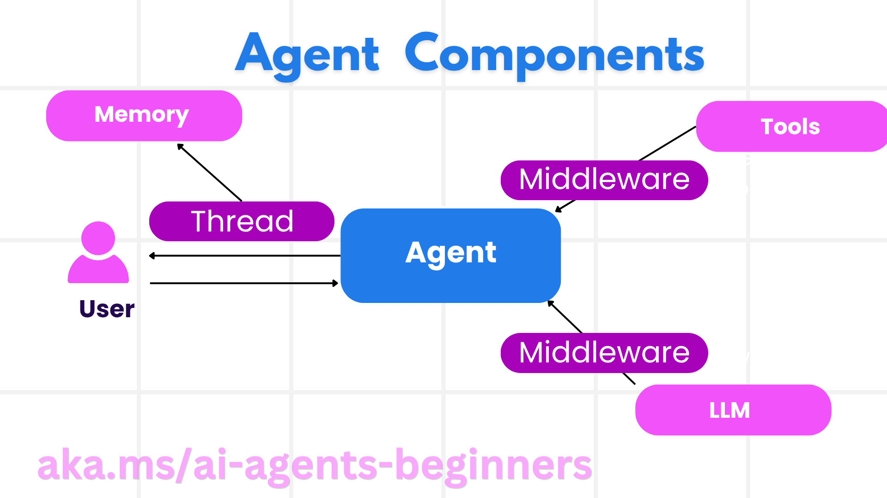

# 理解工作流编排、中间件与人工控制

## 目标与准备

本章将 Microsoft Agent Framework（MAF）的智能体、工具、会话、工作流与观测能力组织成一张可操作的系统设计图。完成后应能选择顺序、并发、交接或条件编排，解释中间件的前后处理顺序，并为人工审批、恢复和失败设计明确边界。

前置知识是 Python 异步、工具调用、消息、Pydantic 与会话记忆；阅读[环境准备](00-setup.zh-CN.md)。目标环境为 Windows、PowerShell 7、Python 3.12+，`agent-framework-core==1.10.0`。离线练习不使用云账号。依据为固定提交 `25b7985f3b2dc37a84f4a7387ccd3c9f0e5b1595` 的[框架原课](https://github.com/deepenable/ai-agents-for-beginners/blob/25b7985f3b2dc37a84f4a7387ccd3c9f0e5b1595/14-microsoft-agent-framework/README.md)及六个 notebook。

**风险提示：** 工作流可能放大模型调用数、费用和权限。多个智能体不等于多个独立授权主体；中间件修改结果也不等于获得了实际库存。所有旅行、会员、退款例子只使用模拟数据，不能接到真实采购或付款系统。托管部署需要额外资源与角色，不属于本章操作。

## 框架提供的价值与不自动提供的保证

MAF 统一智能体构建与编排，也允许不同模型提供商、云和运行环境。可在本机、容器或云端运行，通过 MCP、A2A 和数据连接器连接外部能力。框架不替业务系统完成所有生产责任：

| 能力 | 能提供的基础 | 仍需应用设计 |
| --- | --- | --- |
| 可观测性 | OpenTelemetry 的 trace、span、meter 等接口 | 导出器、采样、脱敏、告警与预算看板 |
| 安全 | 托管平台的身份、角色和内容安全集成 | 最小权限、工具授权、数据边界、网络与应用安全 |
| 持久性 | 状态、事件与检查点机制 | 持久存储、恢复策略、幂等动作和版本迁移 |
| 控制 | 人工请求、暂停/恢复、执行边界 | 审批身份、超时、拒绝路径、审计与撤销 |

这些是构建生产系统的基础，并不意味着执行一个示例就得到“生产就绪”系统。连接器涉及 Fabric、SharePoint、Pinecone、Qdrant 等不同服务时，仍需分别确认授权与数据语义。

## 智能体的组成与版本边界



图中的 Thread 表示会话概念；本次 Python 主线实际使用 `AgentSession` 与 `create_session()`。旧 README 的 `get_new_thread()`、`ChatAgent` 或部分 `create_agent()` 片段不作为 1.10.0 的复制入口，应以当前 notebook 为准。

### 提供商、指令、名称与工具

本模块六个 notebook 都使用 `FoundryChatClient`、`AzureCliCredential` 和 `as_agent()`：

```python
provider = FoundryChatClient(
    project_endpoint=os.environ["AZURE_AI_PROJECT_ENDPOINT"],
    model=os.environ["AZURE_AI_MODEL_DEPLOYMENT_NAME"],
    credential=AzureCliCredential(),
)
agent = provider.as_agent(
    name="travel-reviewer",
    instructions="Review a synthetic itinerary; do not make bookings.",
)
```

这是源码用法的简短说明，运行前还需要相关导入与合法配置。提供商决定认证、API、模型能力和会话实现，不能只替换 URL 就假定工具调用、结构化输出和历史持久化完全等价。

工具可在创建时绑定，也可按单次运行受控提供。工具描述应说明用途、参数、输出和副作用；服务端业务校验才是最终边界。运行时动态工具选择可以结合 RAG 检索工具描述，但必须再过权限白名单。

### 运行、流式与结构化输出

单智能体使用 `await agent.run(...)` 获得结果；本模块工作流流式入口使用 `workflow.run(..., stream=True)` 并迭代事件。不要把工作流事件当成纯文字 token，也不要把 README 的旧 `.run_stream()` 写法混入当前 notebook。

Pydantic 模型定义了输出形状，但**定义类不等于把模式发送给模型**。条件工作流使用 `default_options={"response_format": BookingCheckResult}`；顺序与并发样例只在提示中提到模式名，需要在副本补上对应 `response_format`，才能更可靠地得到可解析结构。

模型输出成功通过 JSON 校验也不等于事实正确。`has_availability`、评分或退款状态仍应与真实工具证据一致。模式只能验证结构和部分约束，不能验证业务事实。

### 会话、持久消息与动态记忆

会话用于多轮上下文；持久消息存储解决进程结束后的历史恢复；动态记忆在运行前检索相关长期资料。三者可以组合，但作用不同：

- 内存会话不会自动落盘。
- 保存聊天文本不是自动获得语义记忆管理。
- Mem0 等动态记忆服务仍需用户隔离、保留期与访问授权。
- 工作流检查点保存的是执行状态，不能仅靠一段会话摘要恢复已执行的付款动作。

## 五类编排模式如何选择

| 模式 | 控制方式 | 适合的任务 | 主要代价与失败点 |
| --- | --- | --- | --- |
| 顺序 | A 的结果进入 B | 推荐后审核、草稿后校订 | 延迟累加，早期错误传递 |
| 并发 | 同一输入发给多个独立执行者 | 景点、餐饮、历史并行研究 | 并发配额、输出归属、整合冲突 |
| 群聊 | 多个参与者交互讨论 | 需要共同推敲的问题 | 历史膨胀、重复发言、难以终止 |
| 交接 | 当前智能体把控制交给专家 | 客服分诊、退款与行程核查 | 错路由、循环、历史和身份丢失 |
| 管理者式动态编排 | 管理者规划、修改任务并协调子智能体 | 任务路径不能预先固定的问题 | 预算失控、反复规划、停止条件不清 |

原课将最后一类称为 Magnetic orchestration；重点是理解管理者持续调整任务计划的行为，而不是把名称当作所有版本都提供的固定类。当前六个 notebook没有完整演示群聊或该管理者模式，不应声称已经验证它们。

条件工作流则强调**确定性分支**：库存真/假决定下一节点。它可以与上面的模式结合。例如先并发检索，再顺序汇总，遇到高风险动作时暂停等待人类。

## 工作流的执行器、边、输出与事件

### 执行器负责处理消息

执行器可以包装 AI 智能体，也可以是普通 Python 逻辑。样例中的 `AgentExecutor` 适配智能体；`InputDispatcher` 只转发输入；`display_result` 只输出最终文本。不是每个执行器都需要一次模型调用。

输入/输出类型是图的契约。酒店工作流用 `AgentExecutorRequest` 包装 `Message`，接收 `AgentExecutorResponse` 后验证 JSON，再决定路由。

### 边负责消息流动

- **直接边**：推荐交给审核者。
- **条件边**：有房去建议预订，无房去推荐替代。
- **Switch-case**：按明确分支规则选择一个目标；需定义默认分支。
- **Fan-out**：把一个输入分发给多个独立节点。
- **Fan-in**：汇集多个节点结果后进入整合节点。

并发 notebook 有 fan-out 和三个输出执行器，但没有专门的 fan-in 汇总智能体；其显示函数在客户端整理三个结果。把多个输出显示在同一页面，不等于业务上完成了冲突消解。

### 输出不等于所有事件

`output_executors` 声明哪些节点结果作为工作流输出；`events.get_outputs()` 取得这些结果。流式事件还可能包含开始、状态、执行器调用/完成、错误、交接和 `request_info`。

旧文档列出的 `WorkflowStartedEvent`、`WorkflowOutputEvent` 等名称用于理解语义；当前 notebook 多按 `event.type` 与 `event.state` 处理。应查看实际类型，不能凭名称猜属性。记录执行器 ID、类型、状态、耗时与错误码，一般比记录全部消息更安全。

## 中间件：控制调用前后，而不伪造事实

### 函数中间件与聊天中间件

函数中间件包围工具调用，可以做参数验证、权限校验、限流、计时或检查结果。聊天中间件包围模型请求，可观察消息数量、受控调整调用选项或检查响应。

关键控制点是 `await next(context)`：

```python
async def audit_function(context, next):
    print({"stage": "before", "function": context.function.name})
    await next(context)
    print({"stage": "after", "function": context.function.name})
```

这是结构示例，不包含实际授权。调用 `next` 才继续后续中间件或真实函数；安全拒绝时应明确返回错误/拒绝结果，不静默“成功”。异常时还应有受控错误记录，不能在异常回退中自动批准。

### 组合顺序与会员示例

若链顺序是授权 A、计时 B，则调用轨迹通常为 A 前置 → B 前置 → 工具 → B 后置 → A 后置。授权应发生在副作用之前；只在工具执行后检查权限已经太晚。

会员 notebook 的 `priority_check_middleware` 先执行 `hotel_booking`，然后把会员的“无房”改为“有房”，使图进入预订建议分支。这演示了修改 `context.result` 如何影响控制流，不是可用于真实库存的业务规则。

它用全局 `current_user_id` 表示用户，只适合单用户课堂演示；多请求并发会混淆身份。生产设计应使用已认证会话上下文，查询真实的保留库存，保存原始结果与规则依据，不能把会员身份当成凭空制造房间的理由。

## 人工控制、恢复与检查点

人机协同应明确：谁有权批准、批准哪个动作和参数、批准何时失效、拒绝/超时如何处理。

当前 human-loop notebook 的真实路径为：

```text
availability_agent
  有房 → booking_agent → display_result
  无房 → confirmation_agent → DecisionManager.on_confirmation
       → ctx.request_info → 等待答复
       → DecisionManager.on_human_feedback
          yes → alternative_agent → display_result
          no/其他 → cancellation_agent → display_result
```

`HumanFeedbackRequest` 是普通 dataclass；`DecisionManager` 的 `@handler` 发出请求，`@response_handler` 接收答复。源码残留的 `RequestInfoExecutor` 描述和 `prepare_human_request` 节点没有接入当前图，阅读时以 `.add_edge()` 为准。

外层驱动根据 `event.request_id` 发送 `responses`，在**同一个暂停中的 workflow 对象**上继续。重新创建工作流后拿旧请求 ID 恢复并不正确。默认测试使用 `SCRIPTED_ANSWER="yes"`，是无人值守模拟，不是人工真的批准。

检查点可帮助长期任务暂停、序列化和恢复，但本例没有展示持久检查点后端。跨进程恢复还需要任务状态、审批状态、模型会话、版本兼容与业务幂等；不能从 `request_info` 存在推导出这些都已实现。

## 托管 LangGraph 的互操作边界

[托管示例](https://github.com/deepenable/ai-agents-for-beginners/blob/25b7985f3b2dc37a84f4a7387ccd3c9f0e5b1595/14-microsoft-agent-framework/code-samples/14-langchain-hosted-agent.py)说明：LangGraph 的业务图可以保留，通过 `langchain_azure_ai.agents.hosting` 暴露 Foundry 托管协议，不必重写成 MAF 智能体。

| 协议 | 宿主 | 适合场景 |
| --- | --- | --- |
| Responses | `ResponsesHostServer` | 对话、流式、响应历史、会话衔接 |
| Invocations | `InvocationsHostServer` | 自定义 JSON、Webhook、非对话处理 |

源码实际实现前者。它通过 `AIProjectClient.get_openai_client()` 取得模型端点，使用 `DefaultAzureCredential` 与 `https://ai.azure.com/.default` scope，读取 `FOUNDRY_PROJECT_ENDPOINT`、`FOUNDRY_MODEL_NAME`，不同于六个 notebook 的变量名。

外部宿主是 Responses，并不凭自身证明内部 `ChatOpenAI` 一定采用 Responses API；应核对所安装 LangChain 版本与模型调用配置。会话持续性可以结合 `previous_response_id`、conversation 与 LangGraph checkpointer；人工中断可映射为协议中的调用/审批条目，但这些都未在最小脚本中完整演示。

生产托管还需要部署定义、容器与权限，源文档提到 Foundry Project Manager 角色。那是部署边界，不应给只做 notebook 的学员扩大到该角色。本模块不执行 `azd provision` 或 `azd deploy`。

## 离线练习：跟踪一次调用与一次拒绝

### 步骤一：写出路由真值表

工作目录为源码仓库根。用以下纯 Python 代码核对自己的判断，不连接框架或模型：

```powershell
@'
def route(available, reply=None):
    if available:
        return "booking_suggestion"
    if reply is None:
        return "wait_for_feedback"
    return "alternative" if reply.strip().lower() == "yes" else "cancelled"

assert route(True) == "booking_suggestion"
assert route(False) == "wait_for_feedback"
assert route(False, "yes") == "alternative"
assert route(False, "no") == "cancelled"
assert route(False, "maybe") == "cancelled"
print("五种路由状态符合设计；此处没有真实预订")
'@ | .\.venv\Scripts\python.exe -
```

预期所有断言通过。再解释为什么“有房直接给预订建议”在例子中不扣款，但如果替换成真实下单，仍需单独人工授权。

### 步骤二：设计顺序、并发和交接的证据

分别画两节点依赖图、三节点 fan-out 图和客服交接图。标出哪些消息传播、哪些结果输出、哪个事件证明实际交接、哪个地方可能等待用户。为每张图指定调用预算和终止规则。

### 步骤三：检查失败策略

为 JSON 解析失败、会员身份未知、用户拒绝、服务超时各写一条失败路径。未知消息类型不能默认进入真实下单路径；两个条件都为假时必须记录异常，不能无输出却显示成功。

## 验收、排障与清理

合格结果是三张图、一张真值表、一条中间件嵌套轨迹和四条失败策略。若概念与输出冲突，先看真实类型、工具结果和 `.add_edge()`，再看界面说明。不要因状态打印“success”就跳过输出验证。

当前为**待演练**：仅本地源码审阅，未运行模型、六个工作流或托管服务，未使用平台正式校验器。离线练习不创建资源，无需云清理；保存去敏设计记录。下一章的[编排实践](14-practice.zh-CN.md)将逐一对应六个 notebook 与两个 Python 变体。
